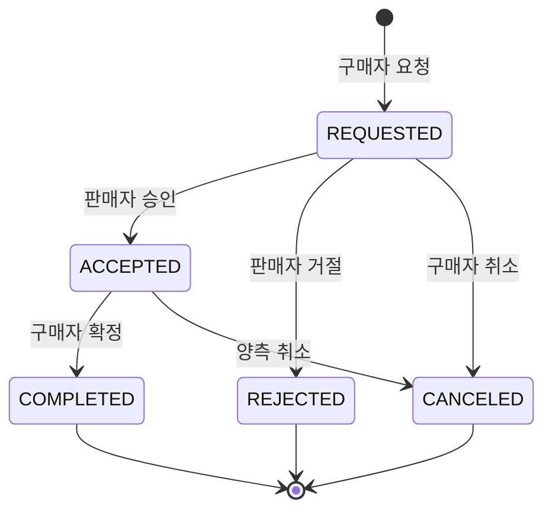

# 규칙 명세

## Re:Used — 규칙 명세

DB 제약과 API 명세로 표현되지 않는 비즈니스 규칙을 정의한다. 컬럼 제약은 DB 스키마 설계 문서를, 요청·응답 형식은 API 명세를 따른다.

### 1. 거래 상태 전이

거래는 게시글과 분리된 독립 엔티티이며, 상태 전이가 게시글 노출 상태를 함께 변경한다 (ADR-007).

| 현재 | 다음 | 수행 주체 | 조건 | 게시글 상태 | 알림 |
| --- | --- | --- | --- | --- | --- |
| — | REQUESTED | 구매자 | 게시글 `ON_SALE`, 본인 게시글 아님 | 변화 없음 | 판매자 |
| REQUESTED | ACCEPTED | 판매자 | 해당 게시글에 `ACCEPTED` 거래 없음 | → `RESERVED` | 구매자 |
| REQUESTED | REJECTED | 판매자 | — | 변화 없음 | 구매자 |
| REQUESTED | CANCELED | 구매자 | — | 변화 없음 | — |
| ACCEPTED | COMPLETED | **구매자만** | — | → `COMPLETED` | 양측 |
| ACCEPTED | CANCELED | 구매자 또는 판매자 | — | → `ON_SALE` | 상대방 |

`COMPLETED`, `REJECTED`, `CANCELED`는 최종 상태이며 이후 전이가 없다.

**구현 규칙**

- 완료 확정은 `buyer_id`만 가능하다 (ADR-008)
- 거래 상태 변경과 게시글 상태 변경은 하나의 트랜잭션으로 처리한다
- 모든 전이를 `trade_status_histories`에 기록한다
- 동시 요청은 `version` 낙관적 잠금으로 직렬화한다

**게시글 상태 추가 규칙**

- 진행 중인 거래(`REQUESTED`/`ACCEPTED`)가 있으면 작성자는 게시글을 삭제할 수 없다
- `RESERVED` 상태에서는 새 거래 요청을 받지 않는다
- `HIDDEN`은 관리자 조치 전용이며, 복구 시 직전 상태로 되돌린다

---

### 2. 권한 매트릭스

권한은 역할과 소유권·당사자 여부 두 층으로 검증한다 (ADR-006).

#### 게시글

| 행위 | USER | ADMIN |
| --- | --- | --- |
| 목록·상세 조회 | 가능 (비로그인 포함) | 전체 |
| 등록 | 가능 | — |
| 수정 | `seller_id` 일치 | — |
| 삭제 | `seller_id` 일치 + 진행 거래 없음 | 사유 기록 |
| 숨김·복구 | 불가 | 사유 기록 |

#### 거래

| 행위 | USER | ADMIN |
| --- | --- | --- |
| 조회 | 당사자만 | 가능 |
| 요청 | 본인 게시글 아님 | 불가 |
| 승인·거절 | `seller_id` 일치 | 불가 |
| 완료 확정 | **`buyer_id` 일치** | 불가 |
| 취소 | 당사자 + 완료 이전 | 불가 |

#### 채팅

| 행위 | USER | ADMIN |
| --- | --- | --- |
| 방 생성 | 본인 게시글 아님 | 불가 |
| 목록·메시지 조회 | 참여자만 | 불가 |
| 메시지 전송 | 참여자만 | 불가 |
| 메시지 삭제 | `sender_id` 일치 | 불가 |

관리자는 신고된 메시지만 신고 처리 화면에서 확인한다.

#### 후기

| 행위 | USER | ADMIN |
| --- | --- | --- |
| 작성 | 거래 `COMPLETED` + 당사자 + 거래당 1회 | 불가 |
| 조회 | 가능 | 가능 |
| 삭제 | 불가 | 신고 처리 시 |

#### 관리자 기능

| 행위 | 조건 |
| --- | --- |
| 관리자 화면 접근 | ADMIN |
| 회원 상태 변경 | ADMIN + 사유 기록 |
| 역할 부여·회수 | ADMIN + 사유 기록. 본인 대상 불가 |
| 신고 처리 | ADMIN |
| 감사 로그 조회 | ADMIN |

#### 본인 리소스

프로필, 관심 목록, 알림, 차단 관계는 본인 것만 조회·변경할 수 있다.

#### 이용정지 중 제한

| 허용 | 차단 |
| --- | --- |
| 로그인, 본인 정보 조회, 로그아웃 | 게시글 등록·수정, 거래 요청·승인, 메시지 전송, 후기 작성, 신고 접수 |

Access Token이 최대 30분간 유효하므로, 정지 직후에도 기존 토큰으로 요청이 들어올 수 있다.

#### 차단 필터링

| 대상 | 처리 |
| --- | --- |
| 게시글 목록·검색 | 차단한 사용자의 게시글 제외 |
| 채팅방 생성 | 차단 관계가 있으면 거부 |
| 채팅 목록 | 제외 |

차단은 단방향이며, 차단당한 쪽은 차단 사실을 알 수 없다.

---

### 3. 탈퇴 처리

단일 트랜잭션으로 처리한다 (ADR-012).

1. 진행 중인 거래(`REQUESTED`/`ACCEPTED`)를 `CANCELED`로 전환하고 상대방에게 알림
2. `nickname`을 `탈퇴회원#{user_id}`로 대체
3. `provider_user_id`를 단방향 해시로 변환
4. `status = 'WITHDRAWN'`, `withdrawn_at` 기록
5. 발급된 모든 Refresh Token 폐기

게시글, 후기, 채팅 메시지는 삭제하지 않는다. 익명 처리된 후기는 상대방 평점 집계에 계속 반영한다.

---

### 4. 정책 값

| 항목 | 값 |
| --- | --- |
| 게시글당 이미지 | 최대 5장 |
| 허용 이미지 형식 | JPEG, PNG, WebP |
| Presigned URL 유효기간 | 5분 |
| Access Token 유효기간 | 30분 |
| Refresh Token 유효기간 | 14일 |
| 챗봇 호출 제한 | 사용자당 분당 5회 |
| 알림 폴링 주기 | 30초 |
| 페이지 크기 | 기본 20건, 최대 100건 |
| 이용정지 기본 기간 | 7일 (관리자 변경 가능) |
| **신고 누적 경고 기준** | **최근 90일 내 `RESOLVED` 신고 3건 이상** |
| **WebSocket 인증** | **연결 후 `authenticate` 이벤트로 토큰 전달. 5초 내 미수신 시 연결 종료** |
| **썸네일 생성** | **1차 릴리스 제외. `thumbnailUrl`에 원본 URL 반환** |

---