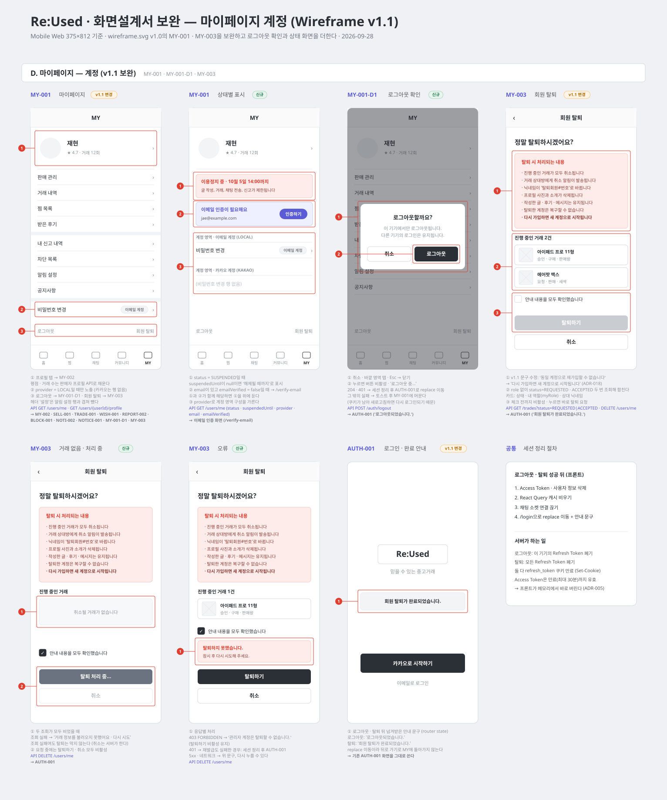

# 마이페이지 계정 화면 (v1.1 보완)

[와이어프레임 v1.0](wireframe.svg)의 MY-001 마이페이지와 MY-003 회원 탈퇴를 보완하고, v1.0에 없던 로그아웃 확인과 상태 화면을 더한다. 대상은 계정 영역(로그아웃·회원 탈퇴)과 이 영역이 걸린 MY-001이다. 메뉴가 가리키는 다른 화면(알림, 신고·차단, 공지, 프로필 수정, 비밀번호 변경)은 각자의 설계를 따른다.



기준 문서: [규칙 명세](../business-rules.md) 2절(이용정지 중 제한)·3절(탈퇴 처리)·5절(인증 수단), ADR-005, ADR-012, ADR-016, ADR-018

## v1.0 대비 바뀐 점

| 화면 | v1.0 | v1.1 | 이유 |
| --- | --- | --- | --- |
| MY-001 | 헤더 오른쪽 `설정` | 뺌 | 메뉴의 `알림 설정`과 겹친다. 다른 설정 화면은 없다 |
| MY-001 | 계정 메뉴 없음 | `비밀번호 변경` 행 (이메일 계정만) | v1.0 이후 이메일 계정이 생겼다 (ADR-016, `FR-AUTH-016`) |
| MY-001 | 이용정지 배너만 언급 | 정지 배너 + 이메일 미인증 배너 | `FR-AUTH-014` |
| MY-001 | 평점·거래 수 출처 없음 | 판매자 프로필 API로 채움 | `GET /users/me`에는 평점·거래 수가 없다 |
| MY-001-D1 | 없음 | 로그아웃 확인 창 | 한 번에 로그아웃되지 않게 |
| MY-003 | "동일 계정으로 재가입할 수 없습니다" | "다시 가입하면 새 계정으로 시작됩니다" | ADR-018: 인증 식별자를 지우므로 재가입할 수 있다. v1.0 파일의 문구도 함께 고쳤다 |
| MY-003 | "닉네임이 '탈퇴회원'으로 변경" | "'탈퇴회원#번호'로 바뀝니다" + 프로필 사진·소개 삭제 | 실제 처리 내용 |
| MY-003 | 기본 상태만 | 거래 없음 · 처리 중 · 오류 상태 추가 | |
| MY-003 | 완료 후 COM-001 | 완료 후 AUTH-001 + 안내 문구 | 스플래시를 거치면 완료 안내를 띄울 곳이 없다 |

## 화면 흐름

```text
MY-001 ──로그아웃──▶ MY-001-D1 ──[로그아웃] 204──▶ AUTH-001 "로그아웃되었습니다."
   │                     └──[취소]──▶ MY-001
   └──회원 탈퇴──▶ MY-003 ──[탈퇴하기] 204──▶ AUTH-001 "회원 탈퇴가 완료되었습니다."
                     └──[취소] / ‹ ──▶ MY-001
```

## 화면 명세

### MY-001 마이페이지

- 경로: `/me` · 진입: 하단 탭 `MY`
- 인증: 로그인 필요. 토큰이 없으면 AUTH-001로 보낸다.

| 영역 | 내용 | 표시 조건 | 누르면 |
| --- | --- | --- | --- |
| 프로필 | 프로필 이미지, 닉네임, `★ 평균 평점 · 거래 N회` | 항상. 평점이 `null`이면 `후기 없음` | MY-002 |
| 이용정지 배너 | "이용정지 중 · {M월 D일 HH:mm}까지" + 제한 안내 | `status = SUSPENDED`이고 `suspendedUntil`이 지나지 않음. `suspendedUntil = null`이면 "해제될 때까지" | — |
| 이메일 미인증 배너 | "이메일 인증이 필요해요" + 주소 + `인증하기` | `email`이 있고 `emailVerified = false` | `/verify-email` |
| 활동 메뉴 | 판매 관리 · 거래 내역 · 찜 목록 · 받은 후기 | 항상 | SELL-001 · TRADE-001 · WISH-001 · 받은 후기 |
| 신뢰·알림 메뉴 | 내 신고 내역 · 차단 목록 · 알림 설정 · 공지사항 | 항상 | REPORT-002 · BLOCK-001 · NOTI-002 · NOTICE-001 |
| 계정 메뉴 | 비밀번호 변경 | `provider = LOCAL`만. 카카오 계정은 행과 구분 띠를 모두 숨긴다 | 비밀번호 변경 화면 |
| 하단 | 로그아웃 (왼쪽) · 회원 탈퇴 (오른쪽) | 항상 | MY-001-D1 · MY-003 |

- 두 배너가 함께 해당하면 정지 배너를 위에 둔다.
- 정지 배너는 `suspendedUntil`과 현재 시각을 비교한다. 정지 해제 작업이 최대 1분 늦게 돌아서, 기간이 끝났는데 `status`가 아직 `SUSPENDED`로 올 수 있다.
- 불러오는 동안 프로필 자리에 스켈레톤을 둔다. 메뉴는 데이터와 무관하므로 바로 그린다.
- `GET /users/me`가 실패하면 프로필 자리에 "정보를 불러오지 못했어요 · 다시 시도"를 보인다. 메뉴와 로그아웃은 그대로 쓸 수 있다.
- 판매자 프로필 조회만 실패하면 평점·거래 수 줄만 숨긴다.

### MY-001-D1 로그아웃 확인

- MY-001 위에 뜨는 확인 창. 경로는 바뀌지 않는다.
- 문구: "로그아웃할까요?" / "이 기기에서만 로그아웃됩니다. 다른 기기의 로그인은 유지됩니다."
- 버튼: `취소`, `로그아웃`. `취소`, 바깥 영역 탭, `Esc`는 창을 닫는다.
- `로그아웃`을 누르면 두 버튼을 비활성으로 바꾸고 `로그아웃 중…`을 표시한다.

| 결과 | 처리 |
| --- | --- |
| 204 | [세션 정리](#세션-정리-절차) 후 AUTH-001 ("로그아웃되었습니다.") |
| 401 (재발급도 실패) | 204와 같다. 서버 세션이 이미 끝났다 |
| 5xx · 네트워크 오류 | 창을 닫고 "로그아웃하지 못했어요. 다시 시도해 주세요." 토스트. 로그인 상태를 유지한다 |

실패했을 때 로컬 상태만 지우고 넘어가지 않는다. `refresh_token` 쿠키는 HttpOnly라 프론트가 지울 수 없으므로, 새로고침하면 다시 로그인된다.

### MY-003 회원 탈퇴

- 경로: `/me/withdraw` · 진입: MY-001 하단 `회원 탈퇴`
- 인증: 로그인 필요

| 영역 | 내용 |
| --- | --- |
| 제목 | "정말 탈퇴하시겠어요?" |
| 처리 안내 | 진행 중인 거래 취소 / 상대방에게 취소 알림 / 닉네임이 '탈퇴회원#번호'로 바뀜 / 프로필 사진·소개 삭제 / 글·후기·메시지 유지 / 계정 복구 불가 / 다시 가입하면 새 계정 |
| 진행 중인 거래 | "진행 중인 거래 N건" + 거래 카드. 카드에는 게시글 제목, 상태(요청·승인), 내 역할(판매·구매), 상대 닉네임을 보인다 |
| 확인 | "안내 내용을 모두 확인했습니다" 체크박스 |
| 버튼 | `탈퇴하기`(체크 전 비활성), `취소` |

상태:

| 상태 | 표시 |
| --- | --- |
| 거래 조회 중 | 거래 영역에 스켈레톤. 체크박스와 버튼은 쓸 수 있다 |
| 거래 없음 | "취소될 거래가 없습니다" |
| 거래 조회 실패 | "거래 정보를 불러오지 못했어요 · 다시 시도". 탈퇴는 막지 않는다. 취소 대상은 서버가 탈퇴 시점에 다시 찾는다 |
| 탈퇴 요청 중 | `탈퇴 처리 중…`, 두 버튼 비활성 |
| 오류 | 버튼 위에 오류 배너 (아래 표) |

| 결과 | 처리 |
| --- | --- |
| 204 | [세션 정리](#세션-정리-절차) 후 AUTH-001 ("회원 탈퇴가 완료되었습니다.") |
| 401 (재발급도 실패) | 세션 정리 후 AUTH-001 ("다시 로그인해 주세요.") |
| 403 `FORBIDDEN` | "관리자 계정은 탈퇴할 수 없습니다." `탈퇴하기` 비활성 유지 |
| 5xx · 네트워크 오류 | "탈퇴하지 못했습니다. 잠시 후 다시 시도해 주세요." 다시 누를 수 있다 |

탈퇴하기를 누르면 추가 확인 창 없이 바로 요청한다. 체크박스가 확인 역할을 한다 (v1.0과 같음).

### AUTH-001 완료 안내

기존 AUTH-001을 그대로 쓴다. 로그아웃·탈퇴 화면이 넘겨준 안내 문구(router state `message`)를 로고 아래에 표시한다. `replace`로 이동하므로 뒤로 가기로 MY 화면에 돌아가지 않는다.

## API 명세

이 화면들이 부르는 API다. 엔드포인트별 상세 명세는 링크를 따른다.

| 화면 | 호출 시점 | API | 쓰는 응답 필드 |
| --- | --- | --- | --- |
| MY-001 | 진입 | [`GET /api/v1/users/me`](<../../05-api/endpoints/users/내 정보 조회.md>) | `userId`, `nickname`, `profileImageUrl`, `status`, `suspendedUntil`, `provider`, `email`, `emailVerified` |
| MY-001 | `userId`를 얻은 뒤 | [`GET /api/v1/users/{userId}/profile`](<../../05-api/endpoints/users/판매자 프로필 조회.md>) | `averageRating`, `completedTradeCount` |
| MY-001-D1 | `로그아웃` | [`POST /api/v1/auth/logout`](<../../05-api/endpoints/auth/로그아웃.md>) | 없음 (204) |
| MY-003 | 진입 | [`GET /api/v1/trades?status=REQUESTED&size=100`](<../../05-api/endpoints/trades/거래 목록 조회.md>) | `tradeId`, `status`, `listing.title`, `listing.thumbnailUrl`, `counterparty.nickname`, `myRole` |
| MY-003 | 진입 | `GET /api/v1/trades?status=ACCEPTED&size=100` | 위와 같음 |
| MY-003 | `탈퇴하기` | [`DELETE /api/v1/users/me`](<../../05-api/endpoints/users/회원 탈퇴.md>) | 없음 (204) |

### `GET /users/me`

- 요청: 본문 없음, `Authorization: Bearer {accessToken}`
- 응답: `MyProfileResponse` (200)
- 401이면 공통 재발급 흐름을 탄다. 재발급도 실패하면 AUTH-001로 보낸다.

### `GET /users/{userId}/profile`

- 인증 없이 호출할 수 있는 공개 API다. 내 `userId`로 불러 평점·거래 수만 쓴다.
- 응답: `SellerProfileResponse` (200). `averageRating`은 후기가 없으면 `null`이다.
- 실패해도 MY-001 전체를 오류로 만들지 않는다.

### `POST /auth/logout`

- 요청: 본문 없음. Access Token과 `refresh_token` 쿠키(자동)
- 응답: 204 + 쿠키 만료 `Set-Cookie`
- 서버는 이 기기의 Refresh Token만 폐기한다. 쿠키가 없어도 204다.
- 오류: 401 `UNAUTHENTICATED`

### `GET /trades` (취소될 거래 미리 보기)

- `role`을 빼면 판매·구매 거래를 모두 받는다. `status`는 한 번에 하나만 받으므로 두 번 부르고 합친다.
- `size`는 최대 100이다. `hasNext = true`면 "N건 이상"으로 표시한다. 정확한 취소 대상은 서버가 탈퇴 시점에 다시 찾는다.
- 정렬은 합친 뒤 `requestedAt` 최신순으로 한다.

### `DELETE /users/me`

- 요청: 본문 없음, Access Token
- 응답: 204 + 쿠키 만료 `Set-Cookie`
- 서버는 한 트랜잭션으로 거래 취소, 알림, 인증 수단 삭제, 닉네임 대체, 상태 변경, 모든 Refresh Token 폐기를 한다.
- 이용정지 중에도 탈퇴할 수 있다.
- 오류: 401 `UNAUTHENTICATED`(없는 회원, 이미 탈퇴함), 403 `FORBIDDEN`(관리자 계정)

## 세션 정리 절차

로그아웃·탈퇴가 끝나면 프론트는 다음 순서로 정리한다. 두 화면이 같은 함수를 쓴다.

1. Access Token과 사용자 정보를 지운다 (`authStore.clear()`).
2. React Query 캐시를 비운다 (`queryClient.clear()`). 남겨 두면 다른 계정으로 로그인했을 때 이전 사용자의 목록이 잠깐 보인다.
3. 채팅 소켓 연결을 끊는다. 채팅 서버는 토큰 서명만 검증하므로 서버가 끊어 주지 않는다. 지금 `chatSocket`에는 공개된 종료 함수가 없어 하나 추가해야 한다.
4. `/login`으로 `replace` 이동하면서 안내 문구를 넘긴다.

Access Token은 서버가 폐기할 수 없어 만료(최대 30분)까지 유효하다 (ADR-005). 그래서 1번을 응답 직후 바로 한다.

## 프론트 라우트

| 화면 | 경로 | 비고 |
| --- | --- | --- |
| MY-001 | `/me` | 하단 탭 `MY`가 가리키는 곳. 지금은 내 활동 화면이 이 경로를 쓴다 |
| 내 활동 (판매 관리 · 받은 요청 · 받은 후기) | `/me/activity` | 기존 `/me` 화면을 옮긴다. `?tab=` 파라미터는 그대로 |
| MY-003 | `/me/withdraw` | 신규 |

MY-001 메뉴의 연결:

| 메뉴 | 연결 | 상태 |
| --- | --- | --- |
| 판매 관리 | `/me/activity` | 있음 |
| 거래 내역 | `/trades` | 있음 |
| 찜 목록 | `/wishes` | 있음 |
| 받은 후기 | `/me/activity?tab=reviews` | 있음 |
| 내 신고 내역 · 차단 목록 · 알림 설정 · 공지사항 | 각 화면 | 다음 단계. 그 전까지 누르면 "준비 중인 기능입니다" 토스트 |
| 비밀번호 변경 | 비밀번호 변경 화면 | 다음 단계. 위와 같음 |

## 팀 확인이 필요한 것

1. **MY-001 헤더 `설정` 제거** — 알림 설정 외에 설정 화면이 없어서 뺐다. 다른 용도가 있으면 알려 달라.
2. **내 활동 화면 경로 이동** (`/me` → `/me/activity`) — 개발자 A 화면이다. 경로를 바꿔도 되는지 A의 확인이 필요하다.
3. **준비 중 메뉴 표시** — 아직 없는 화면의 행을 숨길지, 보이고 토스트를 띄울지. 이 문서는 후자로 적었다 (기존 알림 버튼과 같은 방식).
4. **탈퇴 기록** — 지금 백엔드는 탈퇴할 때 `user_status_histories`와 `audit_logs`에 아무것도 남기지 않는다. 감사 동작 `USER_WITHDRAW`는 정의만 있고 쓰이지 않는다. 회원 상태 변경 이력과 감사 로그를 남길지 정해야 한다. 화면에는 영향이 없다.
5. **관리자 계정의 MY 화면** — 관리자 계정은 탈퇴가 403이다. 관리자에게 MY-001을 보여 줄지, 보여 준다면 `회원 탈퇴`를 숨길지 정해야 한다.

## 관련 요구사항

`FR-AUTH-004`, `FR-AUTH-005`, `FR-AUTH-009~011`, `FR-AUTH-014`, `FR-AUTH-016`, `NFR-AUTH-003`
