# ERD 명세

## Re:Used — DB 스키마 설계

### 이미지 파일 저장 방식

- 원본 이미지 바이너리는 DB가 아닌 **S3** 버킷에 저장
- DB(`listing_images.object_key`)에는 S3 오브젝트 키만 저장 (참조)
- 업로드: 백엔드가 짧은 유효시간(5분)의 **Presigned URL**을 발급, 프론트가 S3로 직접 업로드 → API 서버 경유 없음
- 조회: 비공개 버킷이므로 서명된 URL을 발급해 전달 → public 접근 없음
- 업로드 완료 후 서버가 실제 형식·크기를 재검증한 뒤에야 게시글에 연결 가능

### 채팅 서버와 DB

- 채팅 서버(Node.js)는 **DB에 직접 접근하지 않음**
- 메시지 저장·조회는 API 서버가 담당, 채팅 서버는 Redis Pub/Sub을 통한 실시간 전달만 수행
- 따라서 채팅 서버에는 DB 자격증명을 주입하지 않음

---

### 1. `users` (회원)

| 컬럼 | 타입 | NULL | UNIQUE | 설명 |
| --- | --- | --- | --- | --- |
| user_id | BIGINT, PK, GENERATED ALWAYS AS IDENTITY | NOT NULL | - |  |
| nickname | VARCHAR(20) | NOT NULL | UNIQUE | 온보딩 시 입력. 중복 불허 |
| profile_image_url | TEXT | NULL 허용 | - |  |
| bio | VARCHAR(200) | NULL 허용 | - | 자기소개 |
| role | VARCHAR(10), CHECK IN ('USER','ADMIN') | NOT NULL, DEFAULT 'USER' | - |  |
| status | VARCHAR(20), CHECK IN ('ACTIVE','SUSPENDED','WITHDRAWN') | NOT NULL, DEFAULT 'ACTIVE' | - |  |
| suspended_until | TIMESTAMPTZ | NULL 허용 | - | 이용정지 종료 시각 |
| terms_agreed_at | TIMESTAMPTZ | NOT NULL | - | 약관 동의 시점 |
| created_at | TIMESTAMPTZ | NOT NULL, DEFAULT now() | - |  |
| updated_at | TIMESTAMPTZ | NULL 허용 | - |  |
| withdrawn_at | TIMESTAMPTZ | NULL 허용 | - | 탈퇴 시각 |
- 인증 수단은 `user_identities`로 분리한다. `users`는 사람만 표현한다 (ADR-017)
- 탈퇴 시: `nickname`을 `탈퇴회원#{user_id}`로 대체, `status='WITHDRAWN'`. 인증 수단 행은 삭제하므로 탈퇴 회원은 인증 수단이 없다 (ADR-018)
- 닉네임 유니크를 유지하기 위해 탈퇴 대체 문구에 `user_id`를 붙임

### 2. `user_identities` (인증 수단)

| 컬럼 | 타입 | NULL | UNIQUE | 설명 |
| --- | --- | --- | --- | --- |
| identity_id | BIGINT, PK, GENERATED ALWAYS AS IDENTITY | NOT NULL | - |  |
| user_id | BIGINT, FK → users.user_id, ON DELETE RESTRICT | NOT NULL | 복합 | 인증 수단을 소유한 회원 |
| provider | VARCHAR(20), CHECK IN ('KAKAO','LOCAL') | NOT NULL | 복합 | 인증 제공자 |
| provider_user_id | VARCHAR(255) | NOT NULL | 복합 | `KAKAO`는 회원번호, `LOCAL`은 서버 발급 UUID |
| email | VARCHAR(254) | NULL 허용 | 부분 | `LOCAL` 필수. 소셜은 온보딩 선택 입력 연락처 (ADR-016) |
| password_hash | VARCHAR(255) | NULL 허용 | - | `LOCAL` 필수. 소셜은 항상 NULL |
| email_verified_at | TIMESTAMPTZ | NULL 허용 | - | 이메일 소유 확인 시각. NULL이면 미인증. 이메일이 없으면 항상 NULL |
| created_at | TIMESTAMPTZ | NOT NULL, DEFAULT now() | - |  |
| email_consent_at | TIMESTAMPTZ | NULL 허용 | - | 소셜 이메일 수집·이용 선택 동의 시각. 소셜 인증 수단에 이메일이 있으면 필수. `LOCAL`은 쓰지 않음 (ADR-016, `004`에서 추가) |
- `UNIQUE(provider, provider_user_id)` — 제공자 계정의 유일성. 이메일은 식별에 사용하지 않음 (ADR-016, ADR-017)
- `UNIQUE(user_id, provider)` — 한 회원이 같은 제공자를 중복 연결하지 못하게 함
- **부분 유니크 인덱스**: `UNIQUE(email) WHERE provider='LOCAL'` — 이메일은 `LOCAL` 범위에서만 유일. 이메일 로그인 조회 인덱스를 겸함
- **부분 유니크 인덱스**: `UNIQUE(email) WHERE provider<>'LOCAL' AND email_verified_at IS NOT NULL` — 소유 확인이 끝난 소셜 이메일은 소셜 인증 수단 전체에서 하나만 둔다. 확인 전 주소끼리, 또는 `LOCAL` 이메일과는 겹쳐도 된다 (ADR-016, `004`에서 추가)
- `CHECK (provider <> 'LOCAL' OR email IS NOT NULL)` — 이메일 계정은 이메일 필수
- `CHECK (provider = 'LOCAL' OR password_hash IS NULL)` — 소셜 계정에는 비밀번호를 두지 않음. 이메일은 선택 연락처로 허용 (ADR-016, `004`에서 변경)
- `CHECK (email_verified_at IS NULL OR email IS NOT NULL)` — 이메일 없이 소유 확인 시각만 남지 않게 함 (ADR-016, `004`에서 추가)
- `CHECK (provider = 'LOCAL' OR email IS NULL OR email_consent_at IS NOT NULL)` — 소셜 이메일은 수집·이용 동의 시각과 함께 저장 (ADR-016, `004`에서 추가)
- 탈퇴 시 행을 삭제한다. 식별자·이메일·동의 시각을 보존하지 않으므로 같은 이메일로 재가입할 수 있다 (ADR-018)
- `UNIQUE(user_id, provider)`가 `user_id`로 시작하므로 FK 조회용 인덱스를 따로 만들지 않는다

### 3. `user_status_histories` (회원 상태·역할 변경 이력)

| 컬럼 | 타입 | NULL | UNIQUE | 설명 |
| --- | --- | --- | --- | --- |
| history_id | BIGINT, PK, GENERATED ALWAYS AS IDENTITY | NOT NULL | - |  |
| user_id | BIGINT, FK → users.user_id, ON DELETE RESTRICT | NOT NULL | - | 대상 사용자 |
| change_type | VARCHAR(20), CHECK IN ('STATUS','ROLE') | NOT NULL | - | 상태 변경 / 역할 변경 |
| before_value | VARCHAR(20) | NOT NULL | - |  |
| after_value | VARCHAR(20) | NOT NULL | - |  |
| reason | VARCHAR(500) | NOT NULL | - | 사유 필수 |
| changed_by | BIGINT, FK → users.user_id, ON DELETE RESTRICT | NULL 허용 | - | 시스템 처리(탈퇴 등) 시 null |
| created_at | TIMESTAMPTZ | NOT NULL, DEFAULT now() | - |  |

### 4. `categories` (카테고리)

| 컬럼 | 타입 | NULL | UNIQUE | 설명 |
| --- | --- | --- | --- | --- |
| category_id | BIGINT, PK, GENERATED ALWAYS AS IDENTITY | NOT NULL | - |  |
| name | VARCHAR(50) | NOT NULL | UNIQUE |  |
| display_order | INTEGER | NOT NULL, DEFAULT 0 | - | 노출 순서 |
| is_active | BOOLEAN | NOT NULL, DEFAULT true | - |  |
- 고정 목록. 초기 데이터로 삽입하며 사용자가 추가할 수 없음

### 5. `listings` (중고거래 게시글)

| 컬럼 | 타입 | NULL | UNIQUE | 설명 |
| --- | --- | --- | --- | --- |
| listing_id | BIGINT, PK, GENERATED ALWAYS AS IDENTITY | NOT NULL | - |  |
| seller_id | BIGINT, FK → users.user_id, ON DELETE RESTRICT | NOT NULL | - |  |
| category_id | BIGINT, FK → categories.category_id, ON DELETE RESTRICT | NOT NULL | - |  |
| title | VARCHAR(100) | NOT NULL | - | 2~100자 |
| description | VARCHAR(2000) | NOT NULL | - | 1~2,000자 |
| price | INTEGER, CHECK (price >= 0 AND price <= 100000000) | NOT NULL | - | 원 단위 |
| item_condition | VARCHAR(20), CHECK IN ('NEW','LIKE_NEW','USED','DAMAGED') | NOT NULL | - | 상품 상태 |
| trade_method | VARCHAR(20), CHECK IN ('DIRECT','DELIVERY','BOTH') | NOT NULL | - | 거래 방식 |
| status | VARCHAR(20), CHECK IN ('ON_SALE','RESERVED','COMPLETED','HIDDEN') | NOT NULL, DEFAULT 'ON_SALE' | - | 노출 상태 |
| wish_count | INTEGER | NOT NULL, DEFAULT 0 | - | 파생값. wishes에서 재계산 가능 |
| view_count | INTEGER | NOT NULL, DEFAULT 0 | - | 파생값 |
| created_at | TIMESTAMPTZ | NOT NULL, DEFAULT now() | - |  |
| updated_at | TIMESTAMPTZ | NULL 허용 | - |  |
| deleted_at | TIMESTAMPTZ | NULL 허용 | - | 소프트 삭제 |
| deleted_by | BIGINT, FK → users.user_id, ON DELETE RESTRICT | NULL 허용 | - | 작성자 또는 관리자 |
- `status`는 거래 상태 변경에 따라 시스템이 전환 (ADR-007)
- `HIDDEN`은 관리자 조치 전용
- 진행 중인 거래(`REQUESTED`/`ACCEPTED`)가 있으면 삭제 불가 — 애플리케이션에서 검증

### 6. `listing_images` (게시글 이미지)

| 컬럼 | 타입 | NULL | UNIQUE | 설명 |
| --- | --- | --- | --- | --- |
| image_id | BIGINT, PK, GENERATED ALWAYS AS IDENTITY | NOT NULL | - |  |
| listing_id | BIGINT, FK → listings.listing_id, ON DELETE CASCADE | NULL 허용 | - | 연결 전에는 null |
| uploader_id | BIGINT, FK → users.user_id, ON DELETE RESTRICT | NOT NULL | - | 업로드 수행자 |
| object_key | VARCHAR(500) | NOT NULL | UNIQUE | S3 오브젝트 키. 서버가 생성 |
| thumbnail_key | VARCHAR(500) | NULL 허용 | - | 썸네일 오브젝트 키 |
| content_type | VARCHAR(100) | NOT NULL | - | 서버 재검증 결과 |
| file_size | BIGINT | NOT NULL | - | 바이트 단위, 최대 10MB |
| status | VARCHAR(20), CHECK IN ('PENDING','VERIFIED','REJECTED') | NOT NULL, DEFAULT 'PENDING' | - | 검증 상태 |
| display_order | INTEGER | NOT NULL, DEFAULT 0 | - | 게시글 내 순서 (0~4) |
| created_at | TIMESTAMPTZ | NOT NULL, DEFAULT now() | - |  |
- Presigned URL 발급 시 `PENDING`으로 생성, 서버 검증 통과 후 `VERIFIED`
- `VERIFIED` 상태만 게시글에 연결 가능
- **게시글당 최대 5장** — DB로 강제할 수 없으므로 애플리케이션에서 검증
- `listing_id`가 null인 채 일정 기간 경과한 행은 고아 객체로 정리

### 7. `wishes` (관심 상품)

| 컬럼 | 타입 | NULL | UNIQUE | 설명 |
| --- | --- | --- | --- | --- |
| wish_id | BIGINT, PK, GENERATED ALWAYS AS IDENTITY | NOT NULL | - |  |
| user_id | BIGINT, FK → users.user_id, ON DELETE RESTRICT | NOT NULL | 복합 |  |
| listing_id | BIGINT, FK → listings.listing_id, ON DELETE CASCADE | NOT NULL | 복합 |  |
| created_at | TIMESTAMPTZ | NOT NULL, DEFAULT now() | - |  |
- `UNIQUE(user_id, listing_id)` — 중복 등록 방지

### 8. `trades` (거래)

| 컬럼 | 타입 | NULL | UNIQUE | 설명 |
| --- | --- | --- | --- | --- |
| trade_id | BIGINT, PK, GENERATED ALWAYS AS IDENTITY | NOT NULL | - |  |
| listing_id | BIGINT, FK → listings.listing_id, ON DELETE RESTRICT | NOT NULL | 복합 |  |
| seller_id | BIGINT, FK → users.user_id, ON DELETE RESTRICT | NOT NULL | - | 요청 시점 판매자 |
| buyer_id | BIGINT, FK → users.user_id, ON DELETE RESTRICT | NOT NULL | 복합 |  |
| status | VARCHAR(20), CHECK IN ('REQUESTED','ACCEPTED','COMPLETED','REJECTED','CANCELED') | NOT NULL, DEFAULT 'REQUESTED' | - |  |
| requested_at | TIMESTAMPTZ | NOT NULL, DEFAULT now() | - |  |
| accepted_at | TIMESTAMPTZ | NULL 허용 | - |  |
| completed_at | TIMESTAMPTZ | NULL 허용 | - | 구매자 확정 시각 |
| closed_at | TIMESTAMPTZ | NULL 허용 | - | 거절·취소 시각 |
| closed_by | BIGINT, FK → users.user_id, ON DELETE RESTRICT | NULL 허용 | - | 거절·취소 수행자 |
| version | INTEGER | NOT NULL, DEFAULT 0 | - | 낙관적 잠금 |

**제약조건 (데이터 무결성상 필수):**

- `CHECK (seller_id <> buyer_id)` — 본인 게시글에 거래 요청 불가
- **부분 유니크 인덱스** ①: `CREATE UNIQUE INDEX ON trades(listing_id) WHERE status = 'ACCEPTED';` — 게시글 하나당 승인된 거래가 정확히 1개만 존재하도록 DB 레벨에서 강제 (`FR-TRADE-003`). 동시 승인 요청이 들어와도 두 번째는 실패
- **부분 유니크 인덱스** ②: `CREATE UNIQUE INDEX ON trades(listing_id, buyer_id) WHERE status IN ('REQUESTED','ACCEPTED');` — 동일 구매자의 중복 요청 방지

**동작 방식:**

- 거래 요청: `REQUESTED` 행 생성 → 게시글 `ON_SALE` 유지
- 판매자 승인: `ACCEPTED`로 전이 → 게시글 `RESERVED`로 변경 (한 트랜잭션)
- 구매자 완료 확정: `COMPLETED` → 게시글 `COMPLETED` (ADR-008)
- 취소·거절: `CANCELED`/`REJECTED` → 게시글 `ON_SALE` 복귀
- 모든 전이는 `version` 낙관적 잠금 또는 행 잠금으로 직렬화

### 9. `trade_status_histories` (거래 상태 이력)

| 컬럼 | 타입 | NULL | UNIQUE | 설명 |
| --- | --- | --- | --- | --- |
| history_id | BIGINT, PK, GENERATED ALWAYS AS IDENTITY | NOT NULL | - |  |
| trade_id | BIGINT, FK → trades.trade_id, ON DELETE CASCADE | NOT NULL | - |  |
| before_status | VARCHAR(20) | NULL 허용 | - | 최초 생성 시 null |
| after_status | VARCHAR(20) | NOT NULL | - |  |
| changed_by | BIGINT, FK → users.user_id, ON DELETE RESTRICT | NULL 허용 | - | 시스템 처리 시 null |
| reason | VARCHAR(500) | NULL 허용 | - | 취소 사유 등 |
| created_at | TIMESTAMPTZ | NOT NULL, DEFAULT now() | - |  |
- 이력은 덮어쓰지 않고 누적

### 10. `chat_rooms` (채팅방)

| 컬럼 | 타입 | NULL | UNIQUE | 설명 |
| --- | --- | --- | --- | --- |
| chat_room_id | BIGINT, PK, GENERATED ALWAYS AS IDENTITY | NOT NULL | - |  |
| listing_id | BIGINT, FK → listings.listing_id, ON DELETE RESTRICT | NOT NULL | 복합 |  |
| seller_id | BIGINT, FK → users.user_id, ON DELETE RESTRICT | NOT NULL | - |  |
| buyer_id | BIGINT, FK → users.user_id, ON DELETE RESTRICT | NOT NULL | 복합 |  |
| trade_id | BIGINT, FK → trades.trade_id, ON DELETE SET NULL | NULL 허용 | - | 거래 발생 시 연결 |
| last_message_at | TIMESTAMPTZ | NULL 허용 | - | 목록 정렬용 |
| created_at | TIMESTAMPTZ | NOT NULL, DEFAULT now() | - |  |
- `UNIQUE(listing_id, buyer_id)` — 동일 게시글·구매자 조합은 방 하나
- 채팅이 거래 요청보다 먼저 시작되므로 `trade_id`는 null 허용

### 11. `messages` (메시지)

| 컬럼 | 타입 | NULL | UNIQUE | 설명 |
| --- | --- | --- | --- | --- |
| message_id | BIGINT, PK, GENERATED ALWAYS AS IDENTITY | NOT NULL | - |  |
| chat_room_id | BIGINT, FK → chat_rooms.chat_room_id, ON DELETE CASCADE | NOT NULL | - |  |
| sender_id | BIGINT, FK → users.user_id, ON DELETE RESTRICT | NOT NULL | - |  |
| content | VARCHAR(1000) | NOT NULL | - | 최대 1,000자 |
| read_at | TIMESTAMPTZ | NULL 허용 | - | 상대방이 읽은 시각 |
| created_at | TIMESTAMPTZ | NOT NULL, DEFAULT now() | - |  |
| deleted_at | TIMESTAMPTZ | NULL 허용 | - | 소프트 삭제 |
- 1:1 채팅이므로 별도 참여자 테이블 없이 `read_at` 단일 컬럼으로 처리
- 삭제해도 상대 화면에는 삭제 표시만 남김

### 12. `reviews` (후기)

| 컬럼 | 타입 | NULL | UNIQUE | 설명 |
| --- | --- | --- | --- | --- |
| review_id | BIGINT, PK, GENERATED ALWAYS AS IDENTITY | NOT NULL | - |  |
| trade_id | BIGINT, FK → trades.trade_id, ON DELETE RESTRICT | NOT NULL | 복합 |  |
| reviewer_id | BIGINT, FK → users.user_id, ON DELETE RESTRICT | NOT NULL | 복합 | 작성자 |
| reviewee_id | BIGINT, FK → users.user_id, ON DELETE RESTRICT | NOT NULL | - | 대상자 |
| rating | SMALLINT, CHECK (rating BETWEEN 1 AND 5) | NOT NULL | - | 별점 |
| content | VARCHAR(500) | NULL 허용 | - | 최대 500자 |
| created_at | TIMESTAMPTZ | NOT NULL, DEFAULT now() | - |  |
| deleted_at | TIMESTAMPTZ | NULL 허용 | - | 관리자 숨김 처리 |
- `UNIQUE(trade_id, reviewer_id)` — 거래당 각 당사자 1회
- `CHECK (reviewer_id <> reviewee_id)`
- 거래가 `COMPLETED`일 때만 작성 가능 — 애플리케이션에서 검증

### 13. `community_posts` (커뮤니티 게시글)

| 컬럼 | 타입 | NULL | UNIQUE | 설명 |
| --- | --- | --- | --- | --- |
| post_id | BIGINT, PK, GENERATED ALWAYS AS IDENTITY | NOT NULL | - |  |
| author_id | BIGINT, FK → users.user_id, ON DELETE RESTRICT | NOT NULL | - | 작성자 |
| category | VARCHAR(20), CHECK IN ('GENERAL','QUESTION','TIP','SHARE') | NOT NULL | - | 커뮤니티 카테고리 |
| title | VARCHAR(100), CHECK 길이 2~100 | NOT NULL | - | 제목 |
| content | VARCHAR(3000), CHECK 길이 10~3,000 | NOT NULL | - | 본문 |
| status | VARCHAR(20), CHECK IN ('PUBLISHED','HIDDEN') | NOT NULL, DEFAULT 'PUBLISHED' | - | 공개·신고 처리 숨김 상태 |
| comment_count | INTEGER, CHECK >= 0 | NOT NULL, DEFAULT 0 | - | 노출 가능한 댓글 수 |
| view_count | INTEGER, CHECK >= 0 | NOT NULL, DEFAULT 0 | - | 조회수 |
| created_at | TIMESTAMPTZ | NOT NULL, DEFAULT now() | - |  |
| updated_at | TIMESTAMPTZ | NULL 허용 | - |  |
| deleted_at | TIMESTAMPTZ | NULL 허용 | - | 작성자 소프트 삭제 시각 |
| deleted_by | BIGINT, FK → users.user_id, ON DELETE RESTRICT | NULL 허용 | - | 삭제 수행자 |
- 공개 목록·상세에는 `status='PUBLISHED' AND deleted_at IS NULL`인 행만 노출
- 탈퇴 회원이 작성한 게시글은 보존하되 API 응답의 `author.userId`를 null로 익명화

### 14. `community_comments` (커뮤니티 댓글)

| 컬럼 | 타입 | NULL | UNIQUE | 설명 |
| --- | --- | --- | --- | --- |
| comment_id | BIGINT, PK, GENERATED ALWAYS AS IDENTITY | NOT NULL | - |  |
| post_id | BIGINT, FK → community_posts.post_id, ON DELETE RESTRICT | NOT NULL | - | 대상 게시글 |
| author_id | BIGINT, FK → users.user_id, ON DELETE RESTRICT | NOT NULL | - | 작성자 |
| content | VARCHAR(500), CHECK 길이 1~500 | NOT NULL | - | 평면 텍스트 댓글 |
| status | VARCHAR(20), CHECK IN ('PUBLISHED','HIDDEN') | NOT NULL, DEFAULT 'PUBLISHED' | - | 공개·신고 처리 숨김 상태 |
| created_at | TIMESTAMPTZ | NOT NULL, DEFAULT now() | - |  |
| deleted_at | TIMESTAMPTZ | NULL 허용 | - | 작성자 소프트 삭제 시각 |
| deleted_by | BIGINT, FK → users.user_id, ON DELETE RESTRICT | NULL 허용 | - | 삭제 수행자 |
- 대댓글 구조를 두지 않으며 이미지·좋아요·북마크 컬럼도 두지 않음
- 공개 목록에는 `status='PUBLISHED' AND deleted_at IS NULL`인 행만 노출

### 15. `reports` (신고)

| 컬럼 | 타입 | NULL | UNIQUE | 설명 |
| --- | --- | --- | --- | --- |
| report_id | BIGINT, PK, GENERATED ALWAYS AS IDENTITY | NOT NULL | - |  |
| reporter_id | BIGINT, FK → users.user_id, ON DELETE RESTRICT | NOT NULL | 복합 |  |
| target_type | VARCHAR(20), CHECK IN ('LISTING','USER','MESSAGE','COMMUNITY_POST','COMMUNITY_COMMENT') | NOT NULL | 복합 |  |
| target_id | BIGINT | NOT NULL | 복합 | 대상 식별자. FK 없음 |
| reason_code | VARCHAR(30) | NOT NULL | 복합 | 사유 코드 |
| detail | VARCHAR(500) | NULL 허용 | - | 상세 내용 |
| status | VARCHAR(20), CHECK IN ('RECEIVED','IN_REVIEW','RESOLVED','REJECTED') | NOT NULL, DEFAULT 'RECEIVED' | - |  |
| handled_by | BIGINT, FK → users.user_id, ON DELETE RESTRICT | NULL 허용 | - | 처리 관리자 |
| handled_at | TIMESTAMPTZ | NULL 허용 | - |  |
| resolution | VARCHAR(500) | NULL 허용 | - | 처리 결과 |
| created_at | TIMESTAMPTZ | NOT NULL, DEFAULT now() | - |  |
- `target_type` + `target_id` 다형 참조이므로 FK를 걸지 않음 → 대상 존재 여부는 애플리케이션에서 검증
- **부분 유니크 인덱스**: 미처리 상태의 동일 신고자·대상·사유 조합 중복 방지

### 16. `blocks` (사용자 차단)

| 컬럼 | 타입 | NULL | UNIQUE | 설명 |
| --- | --- | --- | --- | --- |
| block_id | BIGINT, PK, GENERATED ALWAYS AS IDENTITY | NOT NULL | - |  |
| blocker_id | BIGINT, FK → users.user_id, ON DELETE RESTRICT | NOT NULL | 복합 | 차단한 사용자 |
| blocked_id | BIGINT, FK → users.user_id, ON DELETE RESTRICT | NOT NULL | 복합 | 차단당한 사용자 |
| created_at | TIMESTAMPTZ | NOT NULL, DEFAULT now() | - |  |
- `UNIQUE(blocker_id, blocked_id)`
- `CHECK (blocker_id <> blocked_id)`
- 단방향. 차단당한 쪽은 차단 사실을 알 수 없음

### 17. `notifications` (알림)

| 컬럼 | 타입 | NULL | UNIQUE | 설명 |
| --- | --- | --- | --- | --- |
| notification_id | BIGINT, PK, GENERATED ALWAYS AS IDENTITY | NOT NULL | - |  |
| user_id | BIGINT, FK → users.user_id, ON DELETE CASCADE | NOT NULL | - | 수신자 |
| type | VARCHAR(30) | NOT NULL | - | 알림 유형 |
| title | VARCHAR(100) | NOT NULL | - |  |
| body | VARCHAR(500) | NULL 허용 | - |  |
| target_type | VARCHAR(20) | NULL 허용 | - | 이동 대상 유형 |
| target_id | BIGINT | NULL 허용 | - | 이동 대상 식별자 |
| read_at | TIMESTAMPTZ | NULL 허용 | - |  |
| created_at | TIMESTAMPTZ | NOT NULL, DEFAULT now() | - |  |
- 폴링 방식으로 조회 (ADR-014)

### 18. `notification_settings` (알림 수신 설정)

| 컬럼 | 타입 | NULL | UNIQUE | 설명 |
| --- | --- | --- | --- | --- |
| user_id | BIGINT, PK, FK → users.user_id, ON DELETE CASCADE | NOT NULL | - |  |
| trade_enabled | BOOLEAN | NOT NULL, DEFAULT true | - | 거래 관련 |
| chat_enabled | BOOLEAN | NOT NULL, DEFAULT true | - | 채팅 수신 |
| review_enabled | BOOLEAN | NOT NULL, DEFAULT true | - | 후기 등록 |
| report_enabled | BOOLEAN | NOT NULL, DEFAULT true | - | 신고 처리 결과 |
| notice_enabled | BOOLEAN | NOT NULL, DEFAULT true | - | 공지사항 |
| updated_at | TIMESTAMPTZ | NULL 허용 | - |  |
- 회원가입 시 기본값으로 1행 생성

### 19. `notices` (공지사항)

| 컬럼 | 타입 | NULL | UNIQUE | 설명 |
| --- | --- | --- | --- | --- |
| notice_id | BIGINT, PK, GENERATED ALWAYS AS IDENTITY | NOT NULL | - |  |
| author_id | BIGINT, FK → users.user_id, ON DELETE RESTRICT | NOT NULL | - | 관리자 |
| title | VARCHAR(200) | NOT NULL | - |  |
| content | VARCHAR(5000) | NOT NULL | - | 최대 5,000자 |
| is_pinned | BOOLEAN | NOT NULL, DEFAULT false | - | 상단 고정 |
| created_at | TIMESTAMPTZ | NOT NULL, DEFAULT now() | - |  |
| updated_at | TIMESTAMPTZ | NULL 허용 | - |  |
| deleted_at | TIMESTAMPTZ | NULL 허용 | - | 소프트 삭제 |

### 20. `audit_logs` (감사 로그)

| 컬럼 | 타입 | NULL | UNIQUE | 설명 |
| --- | --- | --- | --- | --- |
| audit_log_id | BIGINT, PK, GENERATED ALWAYS AS IDENTITY | NOT NULL | - |  |
| actor_id | BIGINT, FK → users.user_id, ON DELETE RESTRICT | NULL 허용 | - | 시스템 행위는 null |
| action | VARCHAR(50) | NOT NULL | - | 행위 유형 |
| target_type | VARCHAR(20) | NULL 허용 | - |  |
| target_id | BIGINT | NULL 허용 | - |  |
| result | VARCHAR(20), CHECK IN ('SUCCESS','FAILURE') | NOT NULL | - |  |
| ip_address | INET | NULL 허용 | - |  |
| detail | JSONB | NULL 허용 | - | 부가 정보 |
| created_at | TIMESTAMPTZ | NOT NULL, DEFAULT now() | - |  |
- 인증 이벤트, 게시글 변경, 거래 상태 변경, 관리자 행위, 외부 연동 결과를 기록
- `detail`에 토큰·인증정보·개인정보 원문을 저장하지 않음

---

### 정책 값 요약

| 항목 | 값 | 강제 위치 |
| --- | --- | --- |
| 닉네임 | 2~20자, 중복 불허 | DB UNIQUE + 앱 |
| 이메일 | `LOCAL` 범위에서 중복 불허. 소셜 이메일은 선택이며 소유 확인이 끝난 주소만 소셜 범위에서 중복 불허 | DB 부분 UNIQUE + 앱 |
| 비밀번호 | 8~128자 | 앱 (해시로 저장하므로 DB 길이 제약 불가) |
| 사용자당 인증 수단 | 1차 릴리스는 1개 | 앱 (DB 제약 불가) |
| 게시글 제목 | 2~100자 | 앱 |
| 게시글 설명 | 1~2,000자 | DB 길이 + 앱 |
| 게시글 가격 | 0 ~ 100,000,000원 | DB CHECK |
| 게시글당 이미지 | 최대 5장 | 앱 |
| 이미지 파일 크기 | 최대 10MB | 앱 + Presigned URL 조건 |
| 자기소개 | 최대 200자 | DB 길이 |
| 메시지 | 최대 1,000자 | DB 길이 |
| 후기 내용 | 최대 500자 | DB 길이 |
| 후기 별점 | 1~5 | DB CHECK |
| 커뮤니티 게시글 제목 | 2~100자 | DB CHECK + 앱 |
| 커뮤니티 게시글 본문 | 10~3,000자 | DB CHECK + 앱 |
| 커뮤니티 댓글 | 1~500자 | DB CHECK + 앱 |
| 신고 상세 | 최대 500자 | DB 길이 |
| 공지 내용 | 최대 5,000자 | DB 길이 |

---

### 인덱스

FK 컬럼은 PostgreSQL이 자동으로 인덱스를 만들어주지 않으므로, 조인과 필터에 실제로 사용되는 FK 컬럼에만 최소한의 인덱스를 생성한다. 정렬 최적화와 특수 목적 인덱스는 운영 중 실측 결과에 따라 추가한다.

**FK 인덱스**

| 인덱스 | 대상 | 이유 |
| --- | --- | --- |
| `idx_listings_seller` | `listings(seller_id)` | 판매 관리 화면 |
| `idx_listings_category` | `listings(category_id)` | 카테고리 필터 |
| `idx_listing_images_listing` | `listing_images(listing_id)` | 게시글 이미지 조회 |
| `idx_wishes_user` | `wishes(user_id)` | 관심 목록 조회 |
| `idx_trades_buyer` | `trades(buyer_id)` | 구매 내역 |
| `idx_trades_seller` | `trades(seller_id)` | 판매 내역·수신 요청 |
| `idx_chat_rooms_seller` | `chat_rooms(seller_id)` | 채팅 목록 |
| `idx_chat_rooms_buyer` | `chat_rooms(buyer_id)` | 채팅 목록 |
| `idx_messages_room` | `messages(chat_room_id)` | 메시지 조회 |
| `idx_reviews_reviewee` | `reviews(reviewee_id)` | 판매자 프로필 |
| `idx_community_posts_author` | `community_posts(author_id)` | 작성자 게시글 조회 |
| `idx_community_comments_post_latest` | `community_comments(post_id, created_at DESC, comment_id DESC)` | 게시글 댓글 최신순 조회 |
| `idx_community_comments_author` | `community_comments(author_id)` | 작성자 댓글 조회 |
| `idx_notifications_user` | `notifications(user_id)` | 알림 목록 |

**커뮤니티 조회 인덱스**

| 인덱스 | 대상 | 이유 |
| --- | --- | --- |
| `idx_community_posts_latest` | `community_posts(created_at DESC, post_id DESC) WHERE deleted_at IS NULL AND status = 'PUBLISHED'` | 전체 최신순 커서 조회 |
| `idx_community_posts_category_latest` | `community_posts(category, created_at DESC, post_id DESC) WHERE deleted_at IS NULL AND status = 'PUBLISHED'` | 카테고리별 최신순 커서 조회 |

**부분 유니크 인덱스 (무결성 강제용)**

| 인덱스 | 대상 | 이유 |
| --- | --- | --- |
| `uq_user_identities_email_local` | `user_identities(email) WHERE provider = 'LOCAL'` | 이메일 계정의 이메일 유일성 강제. 이메일 로그인 조회를 겸함 |
| `uq_user_identities_email_social_verified` | `user_identities(email) WHERE provider <> 'LOCAL' AND email_verified_at IS NOT NULL` | 소유 확인된 소셜 이메일을 한 계정에만 둠. 동시 확인 경합도 막음 (ADR-016) |
| `uq_trades_one_accepted_per_listing` | `trades(listing_id) WHERE status = 'ACCEPTED'` | 게시글당 승인 거래 1개 강제 |
| `uq_trades_active_per_buyer` | `trades(listing_id, buyer_id) WHERE status IN ('REQUESTED','ACCEPTED')` | 동일 구매자 중복 요청 방지 |
| `uq_reports_pending_duplicate` | `reports(reporter_id, target_type, target_id, reason_code) WHERE status IN ('RECEIVED','IN_REVIEW')` | 미처리 중복 신고 방지 |

**추가 검토 대상**

운영 또는 부하 시험에서 다음 조회가 느려지면 인덱스를 추가한다.

| 대상 | 후보 인덱스 |
| --- | --- |
| 게시글 키워드 검색 | `listings USING GIN (to_tsvector('simple', ...))` |
| 게시글 목록 정렬 | `listings(status, created_at DESC) WHERE deleted_at IS NULL` |
| 관리자 신고 목록 | `reports(status, created_at)` |
| 미읽음 알림 개수 | `notifications(user_id) WHERE read_at IS NULL` |

---

### ERD

```mermaid
erDiagram
  USERS ||--o{ LISTINGS : sells
  USERS ||--o{ WISHES : wishes
  USERS ||--o{ TRADES : trades
  USERS ||--o{ CHAT_ROOMS : participates
  USERS ||--o{ MESSAGES : sends
  USERS ||--o{ REVIEWS : writes
  USERS ||--o{ COMMUNITY_POSTS : writes
  USERS ||--o{ COMMUNITY_COMMENTS : writes
  USERS ||--o{ REPORTS : reports
  USERS ||--o{ BLOCKS : blocks
  USERS ||--o{ NOTIFICATIONS : receives
  USERS ||--|| NOTIFICATION_SETTINGS : configures
  USERS ||--o{ USER_IDENTITIES : "authenticates with"
  USERS ||--o{ USER_STATUS_HISTORIES : "status changed"
  USERS ||--o{ LISTING_IMAGES : uploads
  USERS ||--o{ NOTICES : posts
  USERS ||--o{ AUDIT_LOGS : acts

  CATEGORIES ||--o{ LISTINGS : categorizes
  LISTINGS ||--o{ LISTING_IMAGES : has
  LISTINGS ||--o{ WISHES : "wished by"
  LISTINGS ||--o{ TRADES : "traded via"
  LISTINGS ||--o{ CHAT_ROOMS : "discussed in"

  TRADES ||--o{ TRADE_STATUS_HISTORIES : "status changed"
  TRADES ||--o{ REVIEWS : "reviewed by"
  TRADES ||--o| CHAT_ROOMS : "linked to"

  CHAT_ROOMS ||--o{ MESSAGES : contains
  COMMUNITY_POSTS ||--o{ COMMUNITY_COMMENTS : contains

  USERS {
    bigint user_id PK
    varchar nickname UK
    varchar role
    varchar status
    timestamptz suspended_until
    timestamptz withdrawn_at
  }
  USER_IDENTITIES {
    bigint identity_id PK
    bigint user_id FK
    varchar provider UK
    varchar provider_user_id UK
    varchar email
    varchar password_hash
    timestamptz email_verified_at
    timestamptz email_consent_at
  }
  USER_STATUS_HISTORIES {
    bigint history_id PK
    bigint user_id FK
    varchar change_type
    varchar before_value
    varchar after_value
    varchar reason
    bigint changed_by FK
  }
  CATEGORIES {
    bigint category_id PK
    varchar name UK
    integer display_order
    boolean is_active
  }
  LISTINGS {
    bigint listing_id PK
    bigint seller_id FK
    bigint category_id FK
    varchar title
    integer price
    varchar item_condition
    varchar trade_method
    varchar status
    integer wish_count
    timestamptz deleted_at
    bigint deleted_by FK
  }
  LISTING_IMAGES {
    bigint image_id PK
    bigint listing_id FK
    bigint uploader_id FK
    varchar object_key UK
    varchar thumbnail_key
    varchar content_type
    bigint file_size
    varchar status
    integer display_order
  }
  WISHES {
    bigint wish_id PK
    bigint user_id FK
    bigint listing_id FK
    timestamptz created_at
  }
  TRADES {
    bigint trade_id PK
    bigint listing_id FK
    bigint seller_id FK
    bigint buyer_id FK
    varchar status
    timestamptz requested_at
    timestamptz accepted_at
    timestamptz completed_at
    timestamptz closed_at
    bigint closed_by FK
    integer version
  }
  TRADE_STATUS_HISTORIES {
    bigint history_id PK
    bigint trade_id FK
    varchar before_status
    varchar after_status
    bigint changed_by FK
    varchar reason
  }
  CHAT_ROOMS {
    bigint chat_room_id PK
    bigint listing_id FK
    bigint seller_id FK
    bigint buyer_id FK
    bigint trade_id FK
    timestamptz last_message_at
  }
  MESSAGES {
    bigint message_id PK
    bigint chat_room_id FK
    bigint sender_id FK
    varchar content
    timestamptz read_at
    timestamptz deleted_at
  }
  REVIEWS {
    bigint review_id PK
    bigint trade_id FK
    bigint reviewer_id FK
    bigint reviewee_id FK
    smallint rating
    varchar content
    timestamptz deleted_at
  }
  COMMUNITY_POSTS {
    bigint post_id PK
    bigint author_id FK
    varchar category
    varchar title
    varchar content
    varchar status
    integer comment_count
    integer view_count
    timestamptz created_at
    timestamptz updated_at
    timestamptz deleted_at
    bigint deleted_by FK
  }
  COMMUNITY_COMMENTS {
    bigint comment_id PK
    bigint post_id FK
    bigint author_id FK
    varchar content
    varchar status
    timestamptz created_at
    timestamptz deleted_at
    bigint deleted_by FK
  }
  REPORTS {
    bigint report_id PK
    bigint reporter_id FK
    varchar target_type
    bigint target_id
    varchar reason_code
    varchar detail
    varchar status
    bigint handled_by FK
    varchar resolution
  }
  BLOCKS {
    bigint block_id PK
    bigint blocker_id FK
    bigint blocked_id FK
    timestamptz created_at
  }
  NOTIFICATIONS {
    bigint notification_id PK
    bigint user_id FK
    varchar type
    varchar title
    varchar body
    varchar target_type
    bigint target_id
    timestamptz read_at
  }
  NOTIFICATION_SETTINGS {
    bigint user_id PK
    boolean trade_enabled
    boolean chat_enabled
    boolean review_enabled
    boolean report_enabled
    boolean notice_enabled
  }
  NOTICES {
    bigint notice_id PK
    bigint author_id FK
    varchar title
    varchar content
    boolean is_pinned
    timestamptz deleted_at
  }
  AUDIT_LOGS {
    bigint audit_log_id PK
    bigint actor_id FK
    varchar action
    varchar target_type
    bigint target_id
    varchar result
    inet ip_address
    jsonb detail
  }
```

**관계 요약**

- `users` → 대부분 테이블과 1:N. 사용자는 판매자·구매자·작성자·신고자 등 여러 역할로 등장하므로 동일 테이블에 복수 FK가 걸림
- `users` → `user_identities`는 1:N. 구조상 한 회원이 여러 인증 수단을 가질 수 있으나, 1차 릴리스는 애플리케이션이 1개로 제한한다 (ADR-017)
- `listings` ↔ `users`는 `trades`를 통한 다대다. 단 `trades`는 단순 조인 테이블이 아니라 상태와 이력을 가진 독립 엔티티 (ADR-007)
- `chat_rooms`는 `trades`와 1:0..1. 채팅이 거래보다 먼저 시작되므로 `trade_id`는 null 허용
- `community_posts` → `community_comments`는 1:N이며 댓글은 한 게시글에만 속하는 평면 구조
- `reports`의 `target_type` + `target_id`는 다형 참조이므로 FK 없음

---

### 애플리케이션 레벨 주의사항 (DB가 막아주지 않음)

**1. 거래 상태 전이와 게시글 상태 전환은 반드시 한 트랜잭션**

- 문제: `trades.status`를 바꿔도 `listings.status`가 자동으로 따라오지 않음
- 규칙: 승인 시 `trades → ACCEPTED` + `listings → RESERVED`, 완료 시 `trades → COMPLETED` + `listings → COMPLETED`, 취소 시 `trades → CANCELED` + `listings → ON_SALE`을 하나의 트랜잭션으로 처리
- 위반 시: 게시글은 예약중인데 거래는 취소된 불일치 상태 발생

**2. 게시글당 이미지 5장 제한은 앱에서 검증**

- 문제: `listing_images`는 게시글당 행 개수를 DB로 제한할 수 없음
- 규칙: 이미지 연결 API에서 기존 `VERIFIED` 연결 개수를 확인한 뒤 5개 미만일 때만 허용

**3. 거래 완료 확정은 `buyer_id`만 가능**

- 문제: DB는 누가 UPDATE했는지 모름
- 규칙: 완료 API에서 인증 사용자와 `trades.buyer_id` 일치를 검증 (ADR-008)
- 위반 시: 판매자가 임의로 거래를 완료 처리 가능

**4. 후기는 `COMPLETED` 거래의 당사자만 작성**

- 문제: `UNIQUE(trade_id, reviewer_id)`는 중복만 막을 뿐, 취소된 거래나 제3자 작성은 막지 못함
- 규칙: 거래 상태가 `COMPLETED`인지, 작성자가 `seller_id` 또는 `buyer_id`인지 검증

**5. 탈퇴 시 익명화 대상 누락 주의**

- 문제: `users.status='WITHDRAWN'`만 바꾸면 닉네임과 인증 수단이 그대로 남음. 인증 수단이 별도 테이블로 빠져 있어 더 놓치기 쉬움
- 규칙: 같은 트랜잭션에서 `nickname` 대체, `user_identities` 행 삭제, 진행 중 거래 취소를 함께 처리하고 커뮤니티 응답의 작성자는 `userId=null`로 익명화 (ADR-012, ADR-018)
- 인증 수단 행이 사라지므로 탈퇴 회원은 구조적으로 로그인할 수 없다. 별도의 로그인 차단 분기에 의존하지 않는다

**6. 사용자당 인증 수단 1개 제한은 앱에서 검증**

- 문제: `user_identities`는 회원당 행 개수를 DB로 제한할 수 없음. `UNIQUE(user_id, provider)`는 같은 제공자의 중복만 막는다
- 규칙: 1차 릴리스에서는 가입·연결 시 해당 `user_id`의 기존 행이 없을 때만 삽입을 허용한다 (ADR-017)

**7. 채팅방·거래 조회 시 당사자 검증 필수**

- 문제: 식별자가 순차 증가값이므로 `/chat-rooms/47`처럼 값을 바꿔 호출 가능
- 규칙: 모든 조회·변경 API에서 인증 사용자가 `seller_id` 또는 `buyer_id`인지 확인 (`NFR-AUTH-009`)

**8. 차단 관계는 조회 시마다 필터링**

- 문제: 차단은 관계 테이블에만 기록되고 게시글·채팅에 반영되지 않음
- 규칙: 중고거래와 커뮤니티 게시글·댓글 목록 조회 쿼리에 차단 사용자 제외 조건을 포함

**9. 커뮤니티 변경 권한은 앱에서 검증**

- 문제: DB는 요청자의 회원 상태와 작성자 일치 여부를 알 수 없음
- 규칙: 작성·수정·삭제 전에 `users.status='ACTIVE'`를 확인하고, 게시글 수정·삭제와 댓글 삭제는 각 `author_id` 일치까지 검증

**10. 댓글 등록·삭제·숨김과 `comment_count` 갱신은 한 트랜잭션**

- 문제: 댓글 행과 게시글의 비정규화 집계 값이 별도로 변경됨
- 규칙: 노출 가능한 댓글 등록·삭제·신고 숨김 시 `community_posts.comment_count`를 같은 트랜잭션에서 증감하고 음수가 되지 않게 처리
- 신고 숨김은 `PUBLISHED → HIDDEN` 최초 전이에 성공한 조건부 갱신에서만 1 감소시켜, 같은 댓글의 반복 신고 처리에도 집계가 중복 감소하지 않게 한다

**11. 이메일 조회는 제공자 조건을 함께 건다**

- 문제: 소셜 인증 수단도 `email`을 가질 수 있어(ADR-016), 제공자 조건 없이 이메일로 조회하면 소셜 계정이 여러 건 잡히거나 로그인·재설정 대상이 된다
- 규칙: 이메일 로그인, 이메일 가입 중복 검사, 비밀번호 재설정 대상 조회는 반드시 `provider = 'LOCAL'`을 포함한다
- 소유 확인 단계의 소셜 이메일 중복 검사는 `provider <> 'LOCAL' AND email_verified_at IS NOT NULL`인 다른 행만 본다. 확인 전 주소와 `LOCAL` 이메일은 중복으로 보지 않는다. 동시 확인은 부분 UNIQUE 위반을 같은 `409`로 바꿔 처리한다
- 위반 시: 소셜 계정에 등록된 이메일로 로그인·비밀번호 재설정이 시도되거나, 확인 전 주소 때문에 주인이 자기 이메일을 확인하지 못한다

---
