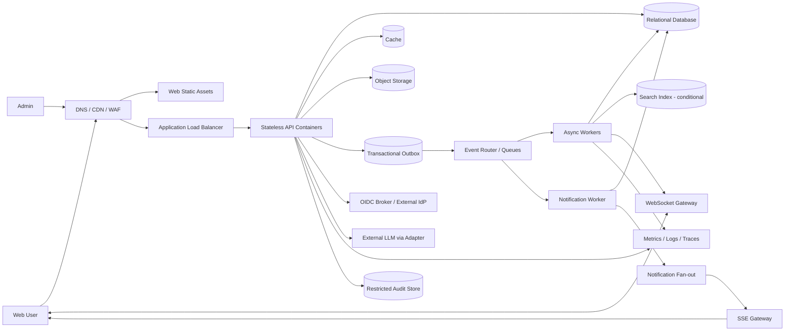

# ADR — 아키텍처 결정 기록

| 항목 | 값 |
|---|---|
| 문서 상태 | Proposed |
| 기준 버전 | 0.2 |
| 선행 문서 | BDR 0.2, NFR 0.2, FDD 0.2 |

## 1. 상태 정의

- `Proposed`: 요구사항상 권고 결정이며 PoC·비용 검증 전
- `Accepted`: 검토와 검증을 통과해 구현 기준으로 승인
- `Superseded`: 후속 ADR로 대체
- `Rejected`: 검토 결과 채택하지 않음

ADR 승인 전 공통 확인 사항은 월간 비용 상한, 팀의 실제 기술 숙련도, 구축 기간 및 개인정보 정책이다.

## 2. 결정 목록

| ID | 결정 | 상태 |
|---|---|---|
| ADR-001 | 모듈러 모놀리스와 비동기 워커로 시작 | Proposed |
| ADR-002 | AWS 단일 리전·다중 AZ 컨테이너 실행 환경 | Proposed |
| ADR-003 | 관리형 사용자 인증과 통합 토큰 정책 사용 | Proposed |
| ADR-004 | 관계형 DB를 진실의 원천으로 사용 | Proposed |
| ADR-005 | Outbox와 관리형 큐를 통한 비동기 처리 | Proposed |
| ADR-006 | 객체 스토리지 직접 업로드와 CDN 이미지 전달 | Proposed |
| ADR-007 | 관리형 WebSocket 게이트웨이로 실시간 이벤트 전달 | Proposed |
| ADR-008 | 관리형 Secret 저장소와 워크로드 역할 사용 | Proposed |
| ADR-009 | OpenTelemetry 기반 관측성과 분리된 감사 로그 | Proposed |
| ADR-010 | 외부 LLM 어댑터와 기능 차단 장치 사용 | Proposed |
| ADR-011 | 단일 리전 Multi-AZ와 백업 기반 지역 복구 | Proposed |
| ADR-012 | SQS 내구성 큐와 SSE를 사용한 알림 전달 | Proposed |
| ADR-013 | 논리 삭제 후 보존정책 기반 자동 파기 | Proposed |
| ADR-014 | 관계형 append-only 포인트 원장 | Proposed |

## 3. 목표 아키텍처 개요

검색 전용 엔진은 초기 필수 구성으로 확정하지 않는다. 관계형 DB 기반 검색이 NFR을 만족하지 못하거나 색인·정렬 요구가 확장되는 시점에 도입한다. SQS는 알림의 내구성 있는 비동기 처리에 사용하고 SSE는 브라우저로의 최종 단방향 전달에 사용한다.

---

## ADR-001 — 모듈러 모놀리스와 비동기 워커로 시작

### 상태

Proposed

### 맥락

회원, 게시글, 거래, 채팅, 신고, 알림, AI는 서로 다른 도메인이지만 개발·운영 인원은 5명이다. 초기부터 독립 마이크로서비스를 구성하면 배포, 네트워크, 데이터 일관성, 추적 및 장애 대응 비용이 급격히 증가한다. 반면 단일 계층에 모든 코드를 결합하면 추후 고부하 기능 분리가 어렵다.

### 결정

초기 애플리케이션은 하나의 배포 가능한 API 애플리케이션과 별도의 비동기 워커로 구성한다. 코드 내부는 인증, 사용자, 게시글, 거래, 채팅, 신고, 알림, AI 모듈로 나누고 다음 규칙을 적용한다.

- 모듈은 다른 모듈의 내부 저장소에 직접 접근하지 않는다.
- 모듈 간 동기 호출은 공개 애플리케이션 인터페이스를 사용한다.
- 비동기 후속 작업은 도메인 이벤트를 사용한다.
- 데이터 소유권, 의존 방향과 이벤트 계약을 문서화한다.
- 채팅, 검색, 알림처럼 독립 확장 필요가 측정된 모듈만 후속 ADR로 분리한다.

### 대안

- 초기 마이크로서비스: 독립 확장에는 유리하지만 5인 팀의 운영 복잡도가 과도하다.
- 계층형 모놀리스: 시작은 빠르지만 도메인 결합과 향후 분리 비용이 크다.
- 전면 서버리스 함수: 이벤트 기능에는 적합하지만 복잡한 도메인 흐름과 로컬 검증의 파편화 가능성이 있다.

### 결과

- 장점: 트랜잭션과 개발 흐름이 단순하고 운영 대상 수가 줄어든다.
- 단점: 전체 애플리케이션 배포가 함께 이루어지고 모듈 규칙을 자동·수동으로 통제해야 한다.
- 분리 기준: 독립 배포 필요, 다른 기능 대비 5배 이상의 자원 특성 차이, 장애 격리 필요 또는 팀 소유권 분리가 확인될 때 재검토한다.

### 검증 및 추적

- 관련: G-005, NFR-MAINT-001~003, FR 전체
- 검증: 모듈 의존성 테스트, 부하 프로파일, 배포 소요시간

---

## ADR-002 — AWS 단일 리전·다중 AZ 컨테이너 실행 환경

### 상태

Proposed

### 맥락

상태 비저장 API는 수평 확장과 무중단 배포가 필요하다. 5인 팀은 클러스터 제어면과 노드 운영보다 애플리케이션과 보안에 집중해야 한다.

### 결정

- API와 워커는 Amazon ECS on Fargate에 컨테이너로 실행한다.
- API는 Application Load Balancer 뒤의 최소 2개 가용 영역에 분산한다.
- 컨테이너는 사설 서브넷에 배치하고 직접 공개 IP를 부여하지 않는다.
- 외부 진입은 CDN/WAF와 로드 밸런서로 제한한다.
- 자동 확장은 CPU·메모리뿐 아니라 요청량, 지연시간 및 큐 적체 지표를 함께 사용한다.
- 인프라는 코드로 관리하고 운영 환경의 직접 변경을 탐지한다.

### 대안

- EKS: 생태계와 제어력이 크지만 초기 운영 부담이 높다.
- EC2 직접 운영: 세밀한 최적화가 가능하지만 패치·용량·배포 책임이 증가한다.
- Lambda 중심: 버스트 처리에는 유리하지만 지속 연결, 애플리케이션 구조와 실행 특성의 제약을 추가 검증해야 한다.

### 결과

- 장점: 노드 운영을 줄이면서 컨테이너 이식성과 수평 확장을 확보한다.
- 단점: 지속 고부하에서는 EC2 대비 비용이 높을 수 있고 Fargate 제약을 따라야 한다.
- 비용 상한 확정 후 정상·피크 태스크 수의 월간 비용을 산정해야 한다.

### 검증 및 추적

- 관련: C-001, G-003~005, NFR-REL-002~003, NFR-SCALE-001~002, NFR-OPS-001
- 검증: 태스크 종료, AZ 장애, 자동 확장, 점진 배포 시험

---

## ADR-003 — 관리형 사용자 인증과 통합 토큰 정책 사용

### 상태

Proposed

### 맥락

이메일·비밀번호 회원가입과 Google 또는 Kakao 외부 로그인을 함께 지원하면서 자격증명을 제품 데이터베이스에 저장하지 않고, 관리자 MFA와 세션 폐기 정책을 적용해야 한다. 외부 제공자별 차이와 자체 비밀번호 저장·복구 책임을 애플리케이션 코드에 직접 결합하지 않는 것이 필요하다.

### 결정

- Amazon Cognito User Pool을 이메일·비밀번호 사용자 저장소이자 OIDC/OAuth 2.0 브로커로 사용한다.
- 이메일 회원가입은 이메일 검증을 필수로 하고 비밀번호 정책, 로그인 시도 제한, 비밀번호 변경·재설정을 User Pool 정책과 애플리케이션 흐름으로 통제한다.
- 지원 가능한 제공자는 표준 OIDC 연동을 우선하며 Google과 Kakao의 실제 속성·로그아웃·검수 요건은 PoC로 확인한다.
- 웹 로그인은 Authorization Code + PKCE를 사용한다.
- 애플리케이션은 서명, 발급자, 대상, 만료 및 토큰 용도를 검증한다.
- Access Token은 30분, Refresh Token은 최대 14일로 구성하고 회전과 폐기를 적용한다.
- 웹 클라이언트는 Refresh Token을 Local Storage에 보관하지 않고 Secure·HttpOnly·SameSite 쿠키 또는 동등한 보호 경계를 사용한다.
- 애플리케이션 내부 User ID를 외부 제공자 ID와 분리한다.
- 제품 데이터베이스에는 비밀번호 원문이나 해시를 저장하지 않는다.
- 관리자 계정은 별도 그룹·권한과 MFA를 적용하고 고위험 작업 시 재인증한다.

### 대안

- 외부 제공자 직접 연동과 자체 비밀번호 저장: 기능 통제는 높지만 자격증명 보호, 복구, 제공자별 보안 패치 책임이 증가한다.
- 자체 인증 서버: 장기 유연성은 크지만 현재 범위와 팀 규모에 비해 계정 보안 위험과 비용이 높다.
- 서버 세션만 사용: 즉시 폐기는 단순하지만 분산 API와 실시간 연결에서 중앙 세션 의존성이 커진다.

### 결과

- 장점: 자체 회원가입과 외부 로그인을 하나의 관리형 사용자 경계에서 제공하고 자격증명 저장 책임을 줄인다.
- 단점: 제공자 매핑, 토큰 폐기 지연 및 서비스 종속성을 설계해야 한다.
- Google/Kakao 계정의 이메일이 같아도 자동 병합하지 않는다.

### 검증 및 추적

- 관련: FR-AUTH-001~009, NFR-SEC-001~012, NFR-AUTHZ-001~005
- 검증: 이메일 검증, 비밀번호 변경·재설정, 계정 열거 방지, 변조·만료·잘못된 발급자 토큰, 로그아웃, 정지 계정, 관리자 MFA 시험

---

## ADR-004 — 관계형 DB를 진실의 원천으로 사용

### 상태

Proposed

### 맥락

거래 상태, 소유권, 중복 방지와 관리자 조치는 강한 일관성과 트랜잭션을 요구한다. 검색과 파생 카운터는 최종 일관성을 허용할 수 있다.

### 결정

- Amazon Aurora PostgreSQL 호환 구성을 업무 데이터의 진실의 원천으로 사용한다.
- Multi-AZ, 자동 백업, 시점 복구와 암호화를 적용한다.
- 거래 상태 전이는 조건부 갱신 또는 행 잠금으로 직렬화한다.
- 유일 제약조건으로 외부 계정, 관심 관계, 후기 및 멱등성 키 중복을 방지한다.
- 거래 완료와 포인트 원장 기록은 같은 관계형 트랜잭션에서 확정하고 포인트 원장을 진실의 원천으로 사용한다.
- 읽기 복제본은 일관성 허용 조회와 운영 분석에만 사용한다.
- Redis 호환 관리형 캐시는 세션 보조, 속도 제한, 단기 캐시와 파생 카운터 가속에 사용하되 진실의 원천으로 사용하지 않는다.
- 초기 검색은 PostgreSQL의 검증된 색인과 검색 기능으로 시작한다. NFR-PERF-003 미달 또는 기능 확장 시 OpenSearch 도입을 별도 ADR로 결정한다.

### 대안

- DynamoDB 중심: 대규모 키 기반 접근에는 유리하지만 복합 거래 규칙과 다양한 관리자 조회 모델의 선행 설계 비용이 크다.
- 초기부터 OpenSearch 병행: 검색 확장성은 높지만 색인 일관성·비용·운영 대상이 증가한다.
- 단일 DB 인스턴스: 비용은 낮지만 가용성과 복구 목표를 충족하지 못한다.

### 결과

- 장점: 데이터 무결성 규칙을 DB와 애플리케이션 양쪽에서 명확히 보장한다.
- 단점: 쓰기 확장 한계와 연결 수를 관리해야 하며 검색 부하가 DB를 압박할 수 있다.
- 연결 풀, 슬로우 쿼리, 인덱스 효율 및 복제 지연을 필수 관측한다.

### 검증 및 추적

- 관련: FR-LIST, FR-TRADE, FR-WISH, FR-REPORT, NFR-CON-001~006, NFR-REL-004~005
- 검증: 동시 거래 수락, 중복 요청, 복원, 검색 부하 시험

---

## ADR-005 — Outbox와 관리형 큐를 통한 비동기 처리

### 상태

Proposed

### 맥락

업무 데이터 저장 후 검색 색인, 알림, 실시간 전달 및 감사 처리를 동기 호출로 연결하면 후속 시스템 장애가 핵심 거래를 실패시킨다. DB 저장과 이벤트 발행 사이의 유실도 방지해야 한다.

### 결정

- 업무 트랜잭션과 같은 DB 트랜잭션에 OutboxEvent를 기록한다.
- 발행기는 미발행 이벤트를 Amazon EventBridge에 전달하고 상태를 갱신한다.
- 소비자별 버퍼와 재시도 격리는 Amazon SQS를 사용한다.
- 모든 이벤트는 eventId, type, version, occurredAt, aggregateId, correlationId를 포함한다.
- 소비자는 eventId 또는 업무 키로 멱등 처리한다.
- 최대 재시도 후 Dead Letter Queue로 격리하고 경보와 재처리 Runbook을 제공한다.
- 이벤트 스키마의 호환되지 않는 변경은 새 버전으로 발행한다.

### 대안

- 서비스 간 동기 호출: 구현은 단순하지만 장애 결합과 지연시간이 증가한다.
- DB 변경 데이터 캡처: 애플리케이션 결합을 줄이지만 운영 기술과 스키마 해석 복잡도가 증가한다.
- Kafka/MSK: 높은 처리량과 재생에는 유리하지만 현재 팀과 초기 규모에 비해 운영·비용 부담이 크다.

### 결과

- 장점: 핵심 트랜잭션과 후속 기능 장애를 분리하고 이벤트 유실을 줄인다.
- 단점: 최종 일관성, 중복 이벤트 및 Outbox 정리 작업을 관리해야 한다.

### 검증 및 추적

- 관련: NFR-REL-006~007, NFR-CON-004~005, FDD 16장 도메인 이벤트
- 검증: 큐 중단, 중복·역순 이벤트, DLQ 재처리 시험

---

## ADR-006 — 객체 스토리지 직접 업로드와 CDN 이미지 전달

### 상태

Proposed

### 맥락

게시글당 최대 5개, 파일당 최대 10MB 이미지를 API 컨테이너가 중계하면 대역폭, 메모리 및 확장 비용이 증가한다. 사용자 파일은 검증 전 공개되어서는 안 된다.

### 결정

- 원본 이미지는 비공개 Amazon S3 버킷에 저장한다.
- 게시글당 연결 가능한 이미지는 최대 5개로 제한한다.
- API는 사용자와 게시글 한도를 확인한 뒤 짧은 수명의 단일 객체용 Presigned Upload 권한을 발급한다.
- 업로드 키는 서버가 생성하고 사용자별 임의 경로 지정을 허용하지 않는다.
- 업로드 완료 이벤트로 실제 형식, 크기 및 악성 여부를 검증한다.
- 검증 전 객체는 격리 경로에 두고 공개 경로로 제공하지 않는다.
- 썸네일과 최적화 이미지를 생성해 CloudFront로 전달한다.
- 원본 버킷의 직접 공개 접근을 차단하고 CDN만 허용한다.
- 고아 객체와 삭제 대상은 보존 정책에 따라 정리한다.

### 대안

- API 서버 경유 업로드: 통제는 단순하지만 서버 자원과 비용이 증가한다.
- 외부 이미지 SaaS: 변환 기능은 편리하지만 비용, 데이터 위치와 종속성이 커질 수 있다.

### 결과

- 장점: 대용량 전송을 API에서 분리하고 CDN 캐시를 활용한다.
- 단점: 비동기 검증 상태, 고아 파일과 객체 수명주기를 관리해야 한다.

### 검증 및 추적

- 관련: FR-IMG-001~005, LOAD-010, NFR-APPSEC-004, NFR-SCALE-003
- 검증: 위조 MIME, 과대 파일, 악성 파일, 만료 URL, 타 사용자 객체 연결 시험

---

## ADR-007 — 관리형 WebSocket 게이트웨이로 실시간 이벤트 전달

### 상태

Proposed

### 맥락

최대 30,000개의 지속 연결을 처리하되 메시지 저장 성공과 실시간 전달 성공을 분리해야 한다. 연결 운영이 핵심 API 컨테이너 확장에 영향을 주지 않아야 한다.

### 결정

- 메시지 생성과 이력 조회는 일반 API가 담당하고 관계형 DB에 먼저 저장한다.
- 새 메시지 이벤트는 비동기 파이프라인을 통해 Amazon API Gateway WebSocket API로 전달한다.
- 연결 레지스트리는 만료 시간을 가진 별도 키-값 저장소에 보관한다.
- 연결 시 토큰과 대화방 참여 권한을 검증하고, 전달 시에도 대상 사용자 관계를 확인한다.
- 전달 실패는 메시지 저장을 취소하지 않는다. 재연결 클라이언트는 마지막 수신 메시지 식별자 이후를 API로 조회해 누락 메시지를 동기화한다. 실시간 폴링 폴백은 사용하지 않는다.
- 하트비트, 연결당 속도 제한, 최대 메시지 크기와 유휴 연결 정책을 둔다.

### 대안

- ECS가 WebSocket 직접 유지: 제어는 높지만 배포·자동 확장·연결 드레이닝이 복잡하다.
- SSE: 서버 단방향 알림에는 단순하지만 양방향 연결 요구 확장에 제약이 있다.
- 주기적 Polling: 구현은 단순하지만 30,000 사용자에서 지연과 불필요 요청이 증가한다.

### 결과

- 장점: 지속 연결의 확장과 수명주기를 관리형 경계로 분리한다.
- 단점: 연결 레지스트리, 게이트웨이 비용과 이중 경로 디버깅이 필요하다.

### 검증 및 추적

- 관련: FR-CHAT-002~007, LOAD-006~007, NFR-PERF-004~005
- 검증: 30,000 연결, 재연결 누락 복구, 무권한 채널 구독, 게이트웨이 장애 시험

---

## ADR-008 — 관리형 Secret 저장소와 워크로드 역할 사용

### 상태

Proposed

### 맥락

DB 자격증명, LLM API Key와 서명 관련 자산은 코드와 분리하고 접근·회전·감사가 가능해야 한다. 애플리케이션 관리자가 평문 Secret을 보는 제품 기능은 필요하지 않다.

### 결정

- Secret 값은 AWS Secrets Manager에 저장하고 KMS 키로 보호한다.
- 컨테이너와 작업은 서비스·환경별 IAM 실행 역할을 사용한다.
- Secret 조회 권한은 필요한 리소스 ARN과 작업으로 제한한다.
- 운영자는 메타데이터와 회전 상태를 볼 수 있지만 평문 조회 권한은 별도 비상 역할로 제한한다.
- 제품 관리자 화면은 Secret 회전을 직접 실행하지 않는다. 회전은 승인된 클라우드 운영 역할, 자동화 또는 별도 Runbook을 통해 수행한다.
- 애플리케이션은 필요 시 메모리 캐시를 사용하되 TTL과 회전 전파 시간을 문서화한다.
- DB Secret은 가능한 경우 자동 회전을 사용하고, 외부 API Key는 이중 키 교체 절차를 Runbook으로 관리한다.
- Secret 접근과 정책 변경 이벤트를 중앙 감사 계정 또는 제한된 감사 경계로 보낸다.

### 대안

- 환경 변수에 수동 주입: 단순하지만 배포·로그·진단 과정의 노출과 회전 부담이 커진다.
- Parameter Store만 사용: 일반 구성에는 적합하지만 Secret 회전 흐름은 별도 구현 부담이 있다.
- 애플리케이션 DB에 암호화 저장: 키 관리와 접근 감사 경계가 애플리케이션에 결합된다.

### 결과

- 장점: 저장, 접근 정책, 회전과 감사를 관리형 서비스로 일관되게 관리한다.
- 단점: API 호출 비용, 캐시 만료와 회전 시 구·신 자격증명 전환을 설계해야 한다.

### 검증 및 추적

- 관련: NFR-SECRET-001~006, NFR-OBS-004~006
- 검증: 과권한 역할, 회전 중 무중단, 로그 노출, 비상 접근 감사 시험

---

## ADR-009 — OpenTelemetry 기반 관측성과 분리된 감사 로그

### 상태

Proposed

### 맥락

동기 API, 비동기 이벤트, 외부 LLM 및 실시간 전달을 하나의 흐름으로 추적해야 한다. 일반 운영 로그와 법적·보안 목적의 감사 로그는 접근 및 보존 요구가 다르다.

### 결정

- 애플리케이션 계측은 OpenTelemetry 규약을 사용한다.
- 메트릭, 애플리케이션 로그와 추적 데이터는 Amazon CloudWatch 계열 서비스로 집계한다.
- 요청·이벤트에 correlationId와 traceId를 전파한다.
- 감사 이벤트는 별도 스키마로 생성해 운영 로그와 분리된 계정/버킷 경계에 저장한다.
- 장기 감사 객체에는 버전 관리, 보존 잠금 또는 동등한 불변 통제를 적용한다.
- 로그 수집 전에 토큰, Secret, 메시지 원문 및 개인정보 필드를 제거·마스킹한다.
- SLO, 외부 연동, 큐 적체, DB 연결, 캐시, 인증 실패 및 비용 대시보드를 제공한다.

### 대안

- 제품별 독점 SDK 직접 사용: 초기 설정은 쉬울 수 있으나 이동성과 계측 일관성이 낮아진다.
- 애플리케이션 로그만 사용: 비용은 낮지만 비동기·분산 흐름의 원인 분석이 어렵다.
- 감사 로그를 동일 로그 그룹에 저장: 구현은 단순하지만 삭제 권한과 보존 정책 분리가 약하다.

### 결과

- 장점: 표준 계측과 중앙 분석, 감사 로그의 독립성을 확보한다.
- 단점: 고카디널리티와 과도한 로그로 비용이 증가할 수 있어 샘플링·보존 정책이 필요하다.

### 검증 및 추적

- 관련: NFR-OBS-001~008, NFR-COST-003, FR-ADMIN-007
- 검증: 사용자 흐름 추적, 민감정보 검사, 감사 로그 변경·삭제 권한 시험

---

## ADR-010 — 외부 LLM 어댑터와 기능 차단 장치 사용

### 상태

Proposed

### 맥락

AI 챗봇은 외부 API 비용, 지연, 장애, 프롬프트 주입 및 데이터 유출 위험을 가진다. 챗봇은 핵심 거래 기능이 아니므로 독립적으로 제한·중지할 수 있어야 한다.

### 결정

- 애플리케이션 내부에 공급자 중립 LLM Adapter 인터페이스를 둔다.
- 초기 챗봇은 플랫폼 이용 안내와 사전 정의된 질문을 중심으로 제공한다.
- 외부 전송 전 개인정보와 내부 식별자를 최소화하고 Secret·토큰을 차단한다.
- 모델에 내부 기능을 직접 실행할 권한을 주지 않는다. 도구 연동은 허용 목록, 스키마 검증, 사용자 재인가와 감사 이벤트를 통과해야 한다.
- 요청 시간 제한, 제한된 재시도, 회로 차단, 사용자별 할당량, 전체 비용 한도와 Kill Switch를 적용한다.
- 출력은 렌더링 전에 안전하게 처리하고 모델 응답을 업무 사실이나 권한 판단의 근거로 사용하지 않는다.
- 제공자 정책과 데이터 보존 옵션을 출시 전에 검토한다.

### 대안

- 공급자 SDK 직접 결합: 구현은 빠르지만 교체와 시험이 어렵다.
- 자체 모델 호스팅: 데이터 통제는 높지만 현재 목표와 팀 규모에 비해 운영 부담이 크다.
- 내부 데이터 전체 RAG: 답변 범위는 넓어지지만 권한 필터, 색인 삭제와 유출 위험이 크게 증가한다.

### 결과

- 장점: 장애와 비용을 격리하고 제공자 교체 가능성을 유지한다.
- 단점: 어댑터, 정책 필터와 품질 평가 체계를 별도로 유지해야 한다.

### 검증 및 추적

- 관련: FR-AI-001~007, NFR-AI-001~006, NFR-REL-006
- 검증: 프롬프트 주입, PII/Secret 유출, 시간 초과, 비용 한도, Kill Switch 시험

---

## ADR-011 — 단일 리전 Multi-AZ와 백업 기반 지역 복구

### 상태

Proposed

### 맥락

NFR은 단일 인스턴스와 가용 영역 장애의 빠른 복구, 지역 재해에 대해 RPO 15분·RTO 4시간을 요구한다. 다중 리전 Active-Active는 초기 팀과 비용 제약에 비해 복잡하다.

### 결정

- 정상 운영은 하나의 AWS 리전과 최소 2개 가용 영역을 사용한다.
- API, 데이터베이스 및 네트워크 경로는 단일 AZ 의존성을 제거한다.
- 관계형 DB는 자동 백업, 시점 복구 및 교차 리전 백업 복제를 사용한다.
- 객체 저장소의 중요 데이터는 버전 관리와 필요 시 교차 리전 복제를 적용한다.
- IaC, 컨테이너 이미지와 구성은 복구 리전에서 재배포 가능하게 보관한다.
- 지역 재해 시 백업 복원 후 DNS 전환하는 Warm Backup 이하의 전략으로 시작한다.
- 반기 복구 훈련에서 RPO/RTO를 측정하고 미달 시 Pilot Light 또는 Warm Standby로 상향한다.

### 대안

- Active-Active 다중 리전: 가장 짧은 복구가 가능하지만 쓰기 일관성, 배포, 운영과 비용 부담이 매우 높다.
- 백업만 보관하고 절차 미검증: 비용은 낮지만 RTO 달성을 증명할 수 없다.
- 단일 AZ: 비용은 낮지만 NFR-REL-003을 충족하지 못한다.

### 결과

- 장점: 일반 장애에는 자동 복구하고 지역 재해 대비 비용을 통제한다.
- 단점: 지역 장애 시 수동 또는 반자동 복구가 필요하고 실제 RTO는 훈련으로 입증해야 한다.

### 검증 및 추적

- 관련: NFR-REL-002~005, NFR-OPS-005~006, G-003~004
- 검증: 인스턴스/AZ 장애, 시점 복구, 교차 리전 복원과 DNS 전환 훈련

---

## ADR-012 — SQS 내구성 큐와 SSE를 사용한 알림 전달

### 상태

Proposed

### 맥락

거래, 메시지, 신고, 후기, 포인트 이벤트는 사용자 알림을 만들지만 알림 처리 실패가 핵심 업무 트랜잭션을 실패시키면 안 된다. 웹 알림은 서버에서 클라이언트로 전달되는 단방향 흐름이므로 채팅 WebSocket과 다른 특성을 가진다.

### 결정

- 도메인 이벤트에서 생성된 알림 작업은 Amazon SQS 알림 큐에 적재한다.
- 알림 워커는 메시지를 멱등하게 소비해 사용자 알림 저장소에 먼저 기록한다.
- 저장된 알림의 실시간 전달 신호는 사용자별 채널로 Fan-out하고, ECS 기반 SSE Gateway가 연결된 웹 클라이언트에 전달한다.
- SQS는 내구성 있는 비동기 버퍼이고 SSE는 브라우저로의 최종 전달 채널이다. SQS를 클라이언트에 직접 노출하지 않는다.
- SSE 이벤트는 notificationId를 이벤트 ID로 포함한다.
- 재연결 클라이언트는 마지막 이벤트 ID 이후의 알림을 API로 조회해 누락을 동기화한다.
- 전송 실패는 알림 저장이나 원인 거래를 롤백하지 않는다.
- 최대 재시도 후 DLQ로 격리하고 적체량·최고 메시지 연령·실패율에 경보를 설정한다.

### 대안

- 채팅 WebSocket을 알림에도 공유: 연결 수를 줄일 수 있지만 채팅 장애·확장 경계와 알림 전달이 결합된다.
- 주기적 Polling: 구현은 단순하지만 지연과 불필요한 요청이 증가한다.
- SSE 없이 외부 푸시만 사용: 브라우저 내 실시간 알림과 조회 복구 요구를 충족하지 못한다.

### 결과

- 장점: 핵심 업무와 알림 장애를 분리하고 브라우저 단방향 실시간 전달을 단순화한다.
- 단점: SSE Gateway의 연결 관리와 다중 인스턴스 Fan-out 경로를 운영해야 한다.
- Fan-out 구현은 초기 PoC에서 Redis Pub/Sub와 관리형 대안을 비교하고 별도 하위 결정으로 확정한다.

### 검증 및 추적

- 관련: FR-NOTI-001~007, LOAD-009, LOAD-011, NFR-REL-007, 009, NFR-PERF-006, 010
- 검증: 10,000 SSE 연결, 중복 SQS 메시지, 재연결 누락 복구, DLQ 재처리 시험

---

## ADR-013 — 논리 삭제 후 보존정책 기반 자동 파기

### 상태

Proposed

### 맥락

사용자 삭제 요청을 즉시 Hard Delete하면 신고 조사, 거래 일관성, 실수 복구와 감사 요구를 훼손할 수 있다. 반대로 논리 삭제 데이터가 무기한 남으면 개인정보와 저장 비용 위험이 증가한다. 제품 관리자가 임의 Hard Delete 권한을 가지는 것도 오조작과 증거 훼손 위험이 크다.

### 결정

- 사용자 탈퇴와 콘텐츠 삭제는 먼저 상태 및 `deleted_at`을 기록하는 논리 삭제로 처리하고 일반 조회에서 즉시 제외한다.
- 보존기간, 데이터 유형, 법적 보존·분쟁·보안 조사 예외를 데이터 보존 정책으로 관리한다.
- 보존기간이 끝나면 스케줄된 파기 작업이 관계형 데이터, 검색 색인, 캐시, 객체 원본과 파생 이미지를 물리 삭제하거나 비가역 익명화한다.
- 백업의 삭제 데이터는 백업 보존기간 만료에 따라 자연 소멸하며 복원 시 재파기 작업을 수행한다.
- 일반 제품 관리자에게 즉시 Hard Delete 기능을 제공하지 않는다.
- 긴급 파기는 별도 운영 역할, 승인, 대상 검증과 감사 로그를 요구한다.
- 파기 작업은 처리 건수, 실패 대상과 예외 보존 대상을 기록하되 삭제된 개인정보 원문을 로그에 남기지 않는다.

### 대안

- 관리자 수동 Hard Delete: 즉시 삭제는 가능하지만 오조작, 권한 남용과 감사 훼손 위험이 높다.
- 무기한 Soft Delete: 복구는 쉽지만 개인정보 최소 보관 원칙과 비용 통제에 부적합하다.
- 모든 데이터를 즉시 익명화: 단순하지만 진행 거래, 신고와 보안 조사 요구를 만족하지 못할 수 있다.

### 결과

- 장점: 사용자 노출 중단, 운영상 제한 보존과 최종 파기를 분리해 안전하게 통제한다.
- 단점: 데이터 계보, 백업, 검색 색인과 객체 저장소를 포함한 파기 오케스트레이션이 필요하다.

### 검증 및 추적

- 관련: FR-USER-003, FR-LIST-004, FR-ADMIN-004, NFR-DATA-007~010, BR-006
- 검증: 삭제 즉시 비노출, 보존 예외, 자동 파기, 실패 재시도, 백업 복원 후 재파기 시험

---

## ADR-014 — 관계형 append-only 포인트 원장

### 상태

Proposed

### 맥락

거래 완료 시 판매자와 구매자에게 내부 포인트를 적립하며 중복 이벤트, 동시 요청과 운영 정정 상황에서도 잔액이 정확해야 한다. 포인트는 현금성 결제 수단이 아니지만 사용자 신뢰와 운영 비용에 영향을 주므로 변경 이력을 보존해야 한다.

### 결정

- Aurora PostgreSQL에 `point_account`와 append-only `point_ledger_entry`를 저장한다.
- 원장 이벤트 유형은 `PENDING_CREDIT`, `PENDING_CANCELED`, `CREDIT`, `REVERSAL`, `EXPIRATION`, `ADMIN_ADJUSTMENT`로 시작한다.
- 원장 항목은 기존 행을 수정·삭제하지 않고 정정 시 반대 방향의 보상 항목을 추가한다.
- 거래 수락 시 사용 불가능한 적립 예정 이벤트를 기록하고, 거래 완료 전환과 양측 포인트 확정 원장 기록은 같은 DB 트랜잭션에서 처리한다.
- 거래 이벤트 ID, 사용자 ID와 원장 유형에 유일 제약을 적용해 중복 적립을 방지한다.
- `point_account.balance`는 조회 성능을 위한 파생값이며 원장 합계로 재계산할 수 있다.
- 잔액 변경은 사용자 계정 행 잠금 또는 낙관적 버전 검사로 직렬화한다.
- 거래가 CANCELED되면 미확정 적립에 `PENDING_CANCELED` 이벤트를 기록하고, 이미 반영된 잘못된 적립은 `REVERSAL` 항목으로 정정한다.
- Redis 카운터는 포인트 잔액의 진실의 원천으로 사용하지 않는다.
- 관리자 조정은 사유, 승인 정보와 감사 이벤트를 필수로 한다.

### 대안

- 사용자 테이블의 잔액만 직접 수정: 단순하지만 변경 근거와 재계산 능력이 없다.
- 별도 포인트 마이크로서비스: 독립 확장에는 유리하지만 현재 팀 규모에서 분산 트랜잭션과 운영 복잡도가 크다.
- 이벤트만 저장하고 동기 잔액 없음: 원장은 명확하지만 사용자 조회마다 집계 비용이 커진다.

### 결과

- 장점: 거래와 포인트를 원자적으로 처리하고 모든 변경의 근거와 재계산 가능성을 확보한다.
- 단점: 원장 크기 증가, 대사 작업과 경합 제어가 필요하다.

### 검증 및 추적

- 관련: FR-POINT-001~007, BR-009~011, NFR-POINT-001~008, SC-008
- 검증: 거래 완료 동시 요청, 이벤트 재처리, 관리자 조정, 원장 대사, 장애 롤백 시험

## 4. ADR 승인 전 필수 PoC

| PoC | 승인 대상 | 합격 기준 |
|---|---|---|
| 인증 제공자 연동 | ADR-003 | 이메일 가입·검증·비밀번호 재설정, Google/Kakao 로그인, 속성 매핑, 로그아웃·폐기, 관리자 MFA 검증 |
| API 및 DB 부하 | ADR-002, 004 | LOAD 기준에서 PERF·오류율 충족, 연결 풀과 비용 기록 |
| 이벤트 내구성 | ADR-005 | DB 커밋 후 이벤트 유실 0, 중복 안전, DLQ 재처리 가능 |
| 이미지 보안 | ADR-006 | 우회 업로드·형식 위조 차단, 비공개 원본 직접 접근 불가 |
| 실시간 연결 | ADR-007 | 30,000 연결과 메시지 목표, 재연결 누락 복구 |
| 알림 전달 | ADR-012 | SQS 중복·실패 격리, 10,000 SSE 연결, 재연결 누락 복구 |
| Secret 회전 | ADR-008 | 평문 노출 없이 서비스 중단 없는 교체 |
| AI 장애·안전 | ADR-010 | 핵심 기능 영향 없음, 데이터 유출·도구 오용 차단 |
| 재해 복구 | ADR-011 | RPO 15분, RTO 4시간 이내 실측 |
| 자동 파기 | ADR-013 | 논리 삭제 즉시 비노출, 보존기간 후 관계형·검색·객체 데이터 파기 |
| 포인트 원장 | ADR-014 | 중복 적립 0건, 거래와 원장 원자성, 잔액 대사 일치 |

## 5. 재검토 트리거

- 실제 또는 시험 부하가 설계 기준의 70%를 지속적으로 초과
- SLO 오류 예산의 반복 소진
- 월간 비용 상한 초과 또는 특정 서비스가 총비용의 30% 초과
- 데이터 분리, 규제 또는 서비스 대상 국가 변경
- 팀 규모·소유권 구조 변경
- 검색, 채팅 또는 알림이 독립 배포·확장을 요구
- Critical 보안 사고 또는 주요 공급자 정책 변경

## 6. 참고 자료

- [AWS Well-Architected Framework](https://docs.aws.amazon.com/wellarchitected/latest/framework/definitions.html)
- [Amazon Cognito OIDC/OAuth endpoints](https://docs.aws.amazon.com/cognito/latest/developerguide/federation-endpoints.html)
- [Amazon Cognito authorization code grant](https://docs.aws.amazon.com/cognito/latest/developerguide/federation-endpoints-oauth-grants.html)
- [AWS Secrets Manager documentation](https://docs.aws.amazon.com/secretsmanager/)
