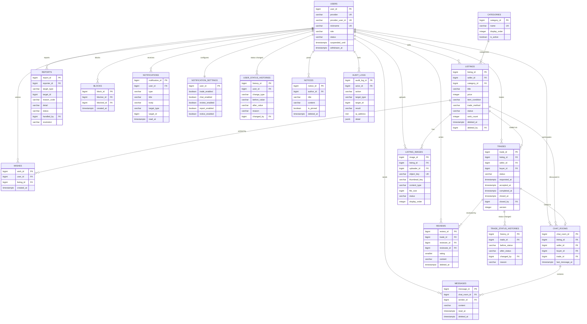

# ERD 명세

## Re:Used — DB 스키마 설계

### 이미지 파일 저장 방식

- 원본 이미지 바이너리는 DB가 아닌 **S3** 버킷에 저장
- DB(`listing_images.object_key`)에는 S3 오브젝트 키만 저장 (참조)
- 업로드: 백엔드가 짧은 유효시간(5분)의 **Presigned URL**을 발급, 프론트가 S3로 직접 업로드 → API 서버 경유 없음
- 조회: 비공개 버킷이므로 서명된 URL을 발급해 전달 → public 접근 없음
- 업로드 완료 후 서버가 실제 형식·크기를 재검증한 뒤에야 게시글에 연결 가능

### 채팅 서버와 DB

- 채팅 서버(Node.js)는 **DB에 직접 접근하지 않음**
- 메시지 저장·조회는 API 서버가 담당, 채팅 서버는 Redis Pub/Sub을 통한 실시간 전달만 수행
- 따라서 채팅 서버에는 DB 자격증명을 주입하지 않음

---

### 1. `users` (회원)

| 컬럼 | 타입 | NULL | UNIQUE | 설명 |
| --- | --- | --- | --- | --- |
| user_id | BIGINT, PK, GENERATED ALWAYS AS IDENTITY | NOT NULL | - |  |
| provider | VARCHAR(20), CHECK IN ('KAKAO') | NOT NULL | 복합 | 소셜 로그인 제공자 |
| provider_user_id | VARCHAR(255) | NOT NULL | 복합 | 카카오 회원번호. 탈퇴 시 해시로 대체 |
| nickname | VARCHAR(20) | NOT NULL | UNIQUE | 온보딩 시 입력. 중복 불허 |
| profile_image_url | TEXT | NULL 허용 | - |  |
| bio | VARCHAR(200) | NULL 허용 | - | 자기소개 |
| role | VARCHAR(10), CHECK IN ('USER','ADMIN') | NOT NULL, DEFAULT 'USER' | - |  |
| status | VARCHAR(20), CHECK IN ('ACTIVE','SUSPENDED','WITHDRAWN') | NOT NULL, DEFAULT 'ACTIVE' | - |  |
| suspended_until | TIMESTAMPTZ | NULL 허용 | - | 이용정지 종료 시각 |
| terms_agreed_at | TIMESTAMPTZ | NOT NULL | - | 약관 동의 시점 |
| created_at | TIMESTAMPTZ | NOT NULL, DEFAULT now() | - |  |
| updated_at | TIMESTAMPTZ | NULL 허용 | - |  |
| withdrawn_at | TIMESTAMPTZ | NULL 허용 | - | 탈퇴 시각 |
- `UNIQUE(provider, provider_user_id)` — 이메일은 수집하지 않으며 식별에 사용하지 않음 (ADR-004)
- 탈퇴 시: `nickname`을 `탈퇴회원#{user_id}`로 대체, `provider_user_id`를 단방향 해시로 변환, `status='WITHDRAWN'`
- 닉네임 유니크를 유지하기 위해 탈퇴 대체 문구에 `user_id`를 붙임

### 2. `user_status_histories` (회원 상태·역할 변경 이력)

| 컬럼 | 타입 | NULL | UNIQUE | 설명 |
| --- | --- | --- | --- | --- |
| history_id | BIGINT, PK, GENERATED ALWAYS AS IDENTITY | NOT NULL | - |  |
| user_id | BIGINT, FK → users.user_id, ON DELETE RESTRICT | NOT NULL | - | 대상 사용자 |
| change_type | VARCHAR(20), CHECK IN ('STATUS','ROLE') | NOT NULL | - | 상태 변경 / 역할 변경 |
| before_value | VARCHAR(20) | NOT NULL | - |  |
| after_value | VARCHAR(20) | NOT NULL | - |  |
| reason | VARCHAR(500) | NOT NULL | - | 사유 필수 |
| changed_by | BIGINT, FK → users.user_id, ON DELETE RESTRICT | NULL 허용 | - | 시스템 처리(탈퇴 등) 시 null |
| created_at | TIMESTAMPTZ | NOT NULL, DEFAULT now() | - |  |

### 3. `categories` (카테고리)

| 컬럼 | 타입 | NULL | UNIQUE | 설명 |
| --- | --- | --- | --- | --- |
| category_id | BIGINT, PK, GENERATED ALWAYS AS IDENTITY | NOT NULL | - |  |
| name | VARCHAR(50) | NOT NULL | UNIQUE |  |
| display_order | INTEGER | NOT NULL, DEFAULT 0 | - | 노출 순서 |
| is_active | BOOLEAN | NOT NULL, DEFAULT true | - |  |
- 고정 목록. 초기 데이터로 삽입하며 사용자가 추가할 수 없음

### 4. `listings` (중고거래 게시글)

| 컬럼 | 타입 | NULL | UNIQUE | 설명 |
| --- | --- | --- | --- | --- |
| listing_id | BIGINT, PK, GENERATED ALWAYS AS IDENTITY | NOT NULL | - |  |
| seller_id | BIGINT, FK → users.user_id, ON DELETE RESTRICT | NOT NULL | - |  |
| category_id | BIGINT, FK → categories.category_id, ON DELETE RESTRICT | NOT NULL | - |  |
| title | VARCHAR(100) | NOT NULL | - | 2~100자 |
| description | VARCHAR(2000) | NOT NULL | - | 1~2,000자 |
| price | INTEGER, CHECK (price >= 0 AND price <= 100000000) | NOT NULL | - | 원 단위 |
| item_condition | VARCHAR(20), CHECK IN ('NEW','LIKE_NEW','USED','DAMAGED') | NOT NULL | - | 상품 상태 |
| trade_method | VARCHAR(20), CHECK IN ('DIRECT','DELIVERY','BOTH') | NOT NULL | - | 거래 방식 |
| status | VARCHAR(20), CHECK IN ('ON_SALE','RESERVED','COMPLETED','HIDDEN') | NOT NULL, DEFAULT 'ON_SALE' | - | 노출 상태 |
| wish_count | INTEGER | NOT NULL, DEFAULT 0 | - | 파생값. wishes에서 재계산 가능 |
| view_count | INTEGER | NOT NULL, DEFAULT 0 | - | 파생값 |
| created_at | TIMESTAMPTZ | NOT NULL, DEFAULT now() | - |  |
| updated_at | TIMESTAMPTZ | NULL 허용 | - |  |
| deleted_at | TIMESTAMPTZ | NULL 허용 | - | 소프트 삭제 |
| deleted_by | BIGINT, FK → users.user_id, ON DELETE RESTRICT | NULL 허용 | - | 작성자 또는 관리자 |
- `status`는 거래 상태 변경에 따라 시스템이 전환 (ADR-007)
- `HIDDEN`은 관리자 조치 전용
- 진행 중인 거래(`REQUESTED`/`ACCEPTED`)가 있으면 삭제 불가 — 애플리케이션에서 검증

### 5. `listing_images` (게시글 이미지)

| 컬럼 | 타입 | NULL | UNIQUE | 설명 |
| --- | --- | --- | --- | --- |
| image_id | BIGINT, PK, GENERATED ALWAYS AS IDENTITY | NOT NULL | - |  |
| listing_id | BIGINT, FK → listings.listing_id, ON DELETE CASCADE | NULL 허용 | - | 연결 전에는 null |
| uploader_id | BIGINT, FK → users.user_id, ON DELETE RESTRICT | NOT NULL | - | 업로드 수행자 |
| object_key | VARCHAR(500) | NOT NULL | UNIQUE | S3 오브젝트 키. 서버가 생성 |
| thumbnail_key | VARCHAR(500) | NULL 허용 | - | 썸네일 오브젝트 키 |
| content_type | VARCHAR(100) | NOT NULL | - | 서버 재검증 결과 |
| file_size | BIGINT | NOT NULL | - | 바이트 단위, 최대 10MB |
| status | VARCHAR(20), CHECK IN ('PENDING','VERIFIED','REJECTED') | NOT NULL, DEFAULT 'PENDING' | - | 검증 상태 |
| display_order | INTEGER | NOT NULL, DEFAULT 0 | - | 게시글 내 순서 (0~4) |
| created_at | TIMESTAMPTZ | NOT NULL, DEFAULT now() | - |  |
- Presigned URL 발급 시 `PENDING`으로 생성, 서버 검증 통과 후 `VERIFIED`
- `VERIFIED` 상태만 게시글에 연결 가능
- **게시글당 최대 5장** — DB로 강제할 수 없으므로 애플리케이션에서 검증
- `listing_id`가 null인 채 일정 기간 경과한 행은 고아 객체로 정리

### 6. `wishes` (관심 상품)

| 컬럼 | 타입 | NULL | UNIQUE | 설명 |
| --- | --- | --- | --- | --- |
| wish_id | BIGINT, PK, GENERATED ALWAYS AS IDENTITY | NOT NULL | - |  |
| user_id | BIGINT, FK → users.user_id, ON DELETE RESTRICT | NOT NULL | 복합 |  |
| listing_id | BIGINT, FK → listings.listing_id, ON DELETE CASCADE | NOT NULL | 복합 |  |
| created_at | TIMESTAMPTZ | NOT NULL, DEFAULT now() | - |  |
- `UNIQUE(user_id, listing_id)` — 중복 등록 방지

### 7. `trades` (거래)

| 컬럼 | 타입 | NULL | UNIQUE | 설명 |
| --- | --- | --- | --- | --- |
| trade_id | BIGINT, PK, GENERATED ALWAYS AS IDENTITY | NOT NULL | - |  |
| listing_id | BIGINT, FK → listings.listing_id, ON DELETE RESTRICT | NOT NULL | 복합 |  |
| seller_id | BIGINT, FK → users.user_id, ON DELETE RESTRICT | NOT NULL | - | 요청 시점 판매자 |
| buyer_id | BIGINT, FK → users.user_id, ON DELETE RESTRICT | NOT NULL | 복합 |  |
| status | VARCHAR(20), CHECK IN ('REQUESTED','ACCEPTED','COMPLETED','REJECTED','CANCELED') | NOT NULL, DEFAULT 'REQUESTED' | - |  |
| requested_at | TIMESTAMPTZ | NOT NULL, DEFAULT now() | - |  |
| accepted_at | TIMESTAMPTZ | NULL 허용 | - |  |
| completed_at | TIMESTAMPTZ | NULL 허용 | - | 구매자 확정 시각 |
| closed_at | TIMESTAMPTZ | NULL 허용 | - | 거절·취소 시각 |
| closed_by | BIGINT, FK → users.user_id, ON DELETE RESTRICT | NULL 허용 | - | 거절·취소 수행자 |
| version | INTEGER | NOT NULL, DEFAULT 0 | - | 낙관적 잠금 |

**제약조건 (데이터 무결성상 필수):**

- `CHECK (seller_id <> buyer_id)` — 본인 게시글에 거래 요청 불가
- **부분 유니크 인덱스** ①: `CREATE UNIQUE INDEX ON trades(listing_id) WHERE status = 'ACCEPTED';` — 게시글 하나당 승인된 거래가 정확히 1개만 존재하도록 DB 레벨에서 강제 (`FR-TRADE-003`). 동시 승인 요청이 들어와도 두 번째는 실패
- **부분 유니크 인덱스** ②: `CREATE UNIQUE INDEX ON trades(listing_id, buyer_id) WHERE status IN ('REQUESTED','ACCEPTED');` — 동일 구매자의 중복 요청 방지

**동작 방식:**

- 거래 요청: `REQUESTED` 행 생성 → 게시글 `ON_SALE` 유지
- 판매자 승인: `ACCEPTED`로 전이 → 게시글 `RESERVED`로 변경 (한 트랜잭션)
- 구매자 완료 확정: `COMPLETED` → 게시글 `COMPLETED` (ADR-008)
- 취소·거절: `CANCELED`/`REJECTED` → 게시글 `ON_SALE` 복귀
- 모든 전이는 `version` 낙관적 잠금 또는 행 잠금으로 직렬화

### 8. `trade_status_histories` (거래 상태 이력)

| 컬럼 | 타입 | NULL | UNIQUE | 설명 |
| --- | --- | --- | --- | --- |
| history_id | BIGINT, PK, GENERATED ALWAYS AS IDENTITY | NOT NULL | - |  |
| trade_id | BIGINT, FK → trades.trade_id, ON DELETE CASCADE | NOT NULL | - |  |
| before_status | VARCHAR(20) | NULL 허용 | - | 최초 생성 시 null |
| after_status | VARCHAR(20) | NOT NULL | - |  |
| changed_by | BIGINT, FK → users.user_id, ON DELETE RESTRICT | NULL 허용 | - | 시스템 처리 시 null |
| reason | VARCHAR(500) | NULL 허용 | - | 취소 사유 등 |
| created_at | TIMESTAMPTZ | NOT NULL, DEFAULT now() | - |  |
- 이력은 덮어쓰지 않고 누적

### 9. `chat_rooms` (채팅방)

| 컬럼 | 타입 | NULL | UNIQUE | 설명 |
| --- | --- | --- | --- | --- |
| chat_room_id | BIGINT, PK, GENERATED ALWAYS AS IDENTITY | NOT NULL | - |  |
| listing_id | BIGINT, FK → listings.listing_id, ON DELETE RESTRICT | NOT NULL | 복합 |  |
| seller_id | BIGINT, FK → users.user_id, ON DELETE RESTRICT | NOT NULL | - |  |
| buyer_id | BIGINT, FK → users.user_id, ON DELETE RESTRICT | NOT NULL | 복합 |  |
| trade_id | BIGINT, FK → trades.trade_id, ON DELETE SET NULL | NULL 허용 | - | 거래 발생 시 연결 |
| last_message_at | TIMESTAMPTZ | NULL 허용 | - | 목록 정렬용 |
| created_at | TIMESTAMPTZ | NOT NULL, DEFAULT now() | - |  |
- `UNIQUE(listing_id, buyer_id)` — 동일 게시글·구매자 조합은 방 하나
- 채팅이 거래 요청보다 먼저 시작되므로 `trade_id`는 null 허용

### 10. `messages` (메시지)

| 컬럼 | 타입 | NULL | UNIQUE | 설명 |
| --- | --- | --- | --- | --- |
| message_id | BIGINT, PK, GENERATED ALWAYS AS IDENTITY | NOT NULL | - |  |
| chat_room_id | BIGINT, FK → chat_rooms.chat_room_id, ON DELETE CASCADE | NOT NULL | - |  |
| sender_id | BIGINT, FK → users.user_id, ON DELETE RESTRICT | NOT NULL | - |  |
| content | VARCHAR(1000) | NOT NULL | - | 최대 1,000자 |
| read_at | TIMESTAMPTZ | NULL 허용 | - | 상대방이 읽은 시각 |
| created_at | TIMESTAMPTZ | NOT NULL, DEFAULT now() | - |  |
| deleted_at | TIMESTAMPTZ | NULL 허용 | - | 소프트 삭제 |
- 1:1 채팅이므로 별도 참여자 테이블 없이 `read_at` 단일 컬럼으로 처리
- 삭제해도 상대 화면에는 삭제 표시만 남김

### 11. `reviews` (후기)

| 컬럼 | 타입 | NULL | UNIQUE | 설명 |
| --- | --- | --- | --- | --- |
| review_id | BIGINT, PK, GENERATED ALWAYS AS IDENTITY | NOT NULL | - |  |
| trade_id | BIGINT, FK → trades.trade_id, ON DELETE RESTRICT | NOT NULL | 복합 |  |
| reviewer_id | BIGINT, FK → users.user_id, ON DELETE RESTRICT | NOT NULL | 복합 | 작성자 |
| reviewee_id | BIGINT, FK → users.user_id, ON DELETE RESTRICT | NOT NULL | - | 대상자 |
| rating | SMALLINT, CHECK (rating BETWEEN 1 AND 5) | NOT NULL | - | 별점 |
| content | VARCHAR(500) | NULL 허용 | - | 최대 500자 |
| created_at | TIMESTAMPTZ | NOT NULL, DEFAULT now() | - |  |
| deleted_at | TIMESTAMPTZ | NULL 허용 | - | 관리자 숨김 처리 |
- `UNIQUE(trade_id, reviewer_id)` — 거래당 각 당사자 1회
- `CHECK (reviewer_id <> reviewee_id)`
- 거래가 `COMPLETED`일 때만 작성 가능 — 애플리케이션에서 검증

### 12. `reports` (신고)

| 컬럼 | 타입 | NULL | UNIQUE | 설명 |
| --- | --- | --- | --- | --- |
| report_id | BIGINT, PK, GENERATED ALWAYS AS IDENTITY | NOT NULL | - |  |
| reporter_id | BIGINT, FK → users.user_id, ON DELETE RESTRICT | NOT NULL | 복합 |  |
| target_type | VARCHAR(20), CHECK IN ('LISTING','USER','MESSAGE') | NOT NULL | 복합 |  |
| target_id | BIGINT | NOT NULL | 복합 | 대상 식별자. FK 없음 |
| reason_code | VARCHAR(30) | NOT NULL | 복합 | 사유 코드 |
| detail | VARCHAR(500) | NULL 허용 | - | 상세 내용 |
| status | VARCHAR(20), CHECK IN ('RECEIVED','IN_REVIEW','RESOLVED','REJECTED') | NOT NULL, DEFAULT 'RECEIVED' | - |  |
| handled_by | BIGINT, FK → users.user_id, ON DELETE RESTRICT | NULL 허용 | - | 처리 관리자 |
| handled_at | TIMESTAMPTZ | NULL 허용 | - |  |
| resolution | VARCHAR(500) | NULL 허용 | - | 처리 결과 |
| created_at | TIMESTAMPTZ | NOT NULL, DEFAULT now() | - |  |
- `target_type` + `target_id` 다형 참조이므로 FK를 걸지 않음 → 대상 존재 여부는 애플리케이션에서 검증
- **부분 유니크 인덱스**: 미처리 상태의 동일 신고자·대상·사유 조합 중복 방지

### 13. `blocks` (사용자 차단)

| 컬럼 | 타입 | NULL | UNIQUE | 설명 |
| --- | --- | --- | --- | --- |
| block_id | BIGINT, PK, GENERATED ALWAYS AS IDENTITY | NOT NULL | - |  |
| blocker_id | BIGINT, FK → users.user_id, ON DELETE RESTRICT | NOT NULL | 복합 | 차단한 사용자 |
| blocked_id | BIGINT, FK → users.user_id, ON DELETE RESTRICT | NOT NULL | 복합 | 차단당한 사용자 |
| created_at | TIMESTAMPTZ | NOT NULL, DEFAULT now() | - |  |
- `UNIQUE(blocker_id, blocked_id)`
- `CHECK (blocker_id <> blocked_id)`
- 단방향. 차단당한 쪽은 차단 사실을 알 수 없음

### 14. `notifications` (알림)

| 컬럼 | 타입 | NULL | UNIQUE | 설명 |
| --- | --- | --- | --- | --- |
| notification_id | BIGINT, PK, GENERATED ALWAYS AS IDENTITY | NOT NULL | - |  |
| user_id | BIGINT, FK → users.user_id, ON DELETE CASCADE | NOT NULL | - | 수신자 |
| type | VARCHAR(30) | NOT NULL | - | 알림 유형 |
| title | VARCHAR(100) | NOT NULL | - |  |
| body | VARCHAR(500) | NULL 허용 | - |  |
| target_type | VARCHAR(20) | NULL 허용 | - | 이동 대상 유형 |
| target_id | BIGINT | NULL 허용 | - | 이동 대상 식별자 |
| read_at | TIMESTAMPTZ | NULL 허용 | - |  |
| created_at | TIMESTAMPTZ | NOT NULL, DEFAULT now() | - |  |
- 폴링 방식으로 조회 (ADR-014)

### 15. `notification_settings` (알림 수신 설정)

| 컬럼 | 타입 | NULL | UNIQUE | 설명 |
| --- | --- | --- | --- | --- |
| user_id | BIGINT, PK, FK → users.user_id, ON DELETE CASCADE | NOT NULL | - |  |
| trade_enabled | BOOLEAN | NOT NULL, DEFAULT true | - | 거래 관련 |
| chat_enabled | BOOLEAN | NOT NULL, DEFAULT true | - | 채팅 수신 |
| review_enabled | BOOLEAN | NOT NULL, DEFAULT true | - | 후기 등록 |
| report_enabled | BOOLEAN | NOT NULL, DEFAULT true | - | 신고 처리 결과 |
| notice_enabled | BOOLEAN | NOT NULL, DEFAULT true | - | 공지사항 |
| updated_at | TIMESTAMPTZ | NULL 허용 | - |  |
- 회원가입 시 기본값으로 1행 생성

### 16. `notices` (공지사항)

| 컬럼 | 타입 | NULL | UNIQUE | 설명 |
| --- | --- | --- | --- | --- |
| notice_id | BIGINT, PK, GENERATED ALWAYS AS IDENTITY | NOT NULL | - |  |
| author_id | BIGINT, FK → users.user_id, ON DELETE RESTRICT | NOT NULL | - | 관리자 |
| title | VARCHAR(200) | NOT NULL | - |  |
| content | VARCHAR(5000) | NOT NULL | - | 최대 5,000자 |
| is_pinned | BOOLEAN | NOT NULL, DEFAULT false | - | 상단 고정 |
| created_at | TIMESTAMPTZ | NOT NULL, DEFAULT now() | - |  |
| updated_at | TIMESTAMPTZ | NULL 허용 | - |  |
| deleted_at | TIMESTAMPTZ | NULL 허용 | - | 소프트 삭제 |

### 17. `audit_logs` (감사 로그)

| 컬럼 | 타입 | NULL | UNIQUE | 설명 |
| --- | --- | --- | --- | --- |
| audit_log_id | BIGINT, PK, GENERATED ALWAYS AS IDENTITY | NOT NULL | - |  |
| actor_id | BIGINT, FK → users.user_id, ON DELETE RESTRICT | NULL 허용 | - | 시스템 행위는 null |
| action | VARCHAR(50) | NOT NULL | - | 행위 유형 |
| target_type | VARCHAR(20) | NULL 허용 | - |  |
| target_id | BIGINT | NULL 허용 | - |  |
| result | VARCHAR(20), CHECK IN ('SUCCESS','FAILURE') | NOT NULL | - |  |
| ip_address | INET | NULL 허용 | - |  |
| detail | JSONB | NULL 허용 | - | 부가 정보 |
| created_at | TIMESTAMPTZ | NOT NULL, DEFAULT now() | - |  |
- 인증 이벤트, 게시글 변경, 거래 상태 변경, 관리자 행위, 외부 연동 결과를 기록
- `detail`에 토큰·인증정보·개인정보 원문을 저장하지 않음

---

### 정책 값 요약

| 항목 | 값 | 강제 위치 |
| --- | --- | --- |
| 닉네임 | 2~20자, 중복 불허 | DB UNIQUE + 앱 |
| 게시글 제목 | 2~100자 | 앱 |
| 게시글 설명 | 1~2,000자 | DB 길이 + 앱 |
| 게시글 가격 | 0 ~ 100,000,000원 | DB CHECK |
| 게시글당 이미지 | 최대 5장 | 앱 |
| 이미지 파일 크기 | 최대 10MB | 앱 + Presigned URL 조건 |
| 자기소개 | 최대 200자 | DB 길이 |
| 메시지 | 최대 1,000자 | DB 길이 |
| 후기 내용 | 최대 500자 | DB 길이 |
| 후기 별점 | 1~5 | DB CHECK |
| 신고 상세 | 최대 500자 | DB 길이 |
| 공지 내용 | 최대 5,000자 | DB 길이 |

---

### 인덱스

FK 컬럼은 PostgreSQL이 자동으로 인덱스를 만들어주지 않으므로, 조인과 필터에 실제로 사용되는 FK 컬럼에만 최소한의 인덱스를 생성한다. 정렬 최적화와 특수 목적 인덱스는 운영 중 실측 결과에 따라 추가한다.

**FK 인덱스**

| 인덱스 | 대상 | 이유 |
| --- | --- | --- |
| `idx_listings_seller` | `listings(seller_id)` | 판매 관리 화면 |
| `idx_listings_category` | `listings(category_id)` | 카테고리 필터 |
| `idx_listing_images_listing` | `listing_images(listing_id)` | 게시글 이미지 조회 |
| `idx_wishes_user` | `wishes(user_id)` | 관심 목록 조회 |
| `idx_trades_buyer` | `trades(buyer_id)` | 구매 내역 |
| `idx_trades_seller` | `trades(seller_id)` | 판매 내역·수신 요청 |
| `idx_chat_rooms_seller` | `chat_rooms(seller_id)` | 채팅 목록 |
| `idx_chat_rooms_buyer` | `chat_rooms(buyer_id)` | 채팅 목록 |
| `idx_messages_room` | `messages(chat_room_id)` | 메시지 조회 |
| `idx_reviews_reviewee` | `reviews(reviewee_id)` | 판매자 프로필 |
| `idx_notifications_user` | `notifications(user_id)` | 알림 목록 |

**부분 유니크 인덱스 (무결성 강제용)**

| 인덱스 | 대상 | 이유 |
| --- | --- | --- |
| `uq_trades_one_accepted_per_listing` | `trades(listing_id) WHERE status = 'ACCEPTED'` | 게시글당 승인 거래 1개 강제 |
| `uq_trades_active_per_buyer` | `trades(listing_id, buyer_id) WHERE status IN ('REQUESTED','ACCEPTED')` | 동일 구매자 중복 요청 방지 |
| `uq_reports_pending_duplicate` | `reports(reporter_id, target_type, target_id, reason_code) WHERE status IN ('RECEIVED','IN_REVIEW')` | 미처리 중복 신고 방지 |

**추가 검토 대상**

운영 또는 부하 시험에서 다음 조회가 느려지면 인덱스를 추가한다.

| 대상 | 후보 인덱스 |
| --- | --- |
| 게시글 키워드 검색 | `listings USING GIN (to_tsvector('simple', ...))` |
| 게시글 목록 정렬 | `listings(status, created_at DESC) WHERE deleted_at IS NULL` |
| 관리자 신고 목록 | `reports(status, created_at)` |
| 미읽음 알림 개수 | `notifications(user_id) WHERE read_at IS NULL` |

---

### ERD



**관계 요약**

- `users` → 대부분 테이블과 1:N. 사용자는 판매자·구매자·작성자·신고자 등 여러 역할로 등장하므로 동일 테이블에 복수 FK가 걸림
- `listings` ↔ `users`는 `trades`를 통한 다대다. 단 `trades`는 단순 조인 테이블이 아니라 상태와 이력을 가진 독립 엔티티 (ADR-007)
- `chat_rooms`는 `trades`와 1:0..1. 채팅이 거래보다 먼저 시작되므로 `trade_id`는 null 허용
- `reports`의 `target_type` + `target_id`는 다형 참조이므로 FK 없음

---

### 애플리케이션 레벨 주의사항 (DB가 막아주지 않음)

**1. 거래 상태 전이와 게시글 상태 전환은 반드시 한 트랜잭션**

- 문제: `trades.status`를 바꿔도 `listings.status`가 자동으로 따라오지 않음
- 규칙: 승인 시 `trades → ACCEPTED` + `listings → RESERVED`, 완료 시 `trades → COMPLETED` + `listings → COMPLETED`, 취소 시 `trades → CANCELED` + `listings → ON_SALE`을 하나의 트랜잭션으로 처리
- 위반 시: 게시글은 예약중인데 거래는 취소된 불일치 상태 발생

**2. 게시글당 이미지 5장 제한은 앱에서 검증**

- 문제: `listing_images`는 게시글당 행 개수를 DB로 제한할 수 없음
- 규칙: 이미지 연결 API에서 기존 `VERIFIED` 연결 개수를 확인한 뒤 5개 미만일 때만 허용

**3. 거래 완료 확정은 `buyer_id`만 가능**

- 문제: DB는 누가 UPDATE했는지 모름
- 규칙: 완료 API에서 인증 사용자와 `trades.buyer_id` 일치를 검증 (ADR-008)
- 위반 시: 판매자가 임의로 거래를 완료 처리 가능

**4. 후기는 `COMPLETED` 거래의 당사자만 작성**

- 문제: `UNIQUE(trade_id, reviewer_id)`는 중복만 막을 뿐, 취소된 거래나 제3자 작성은 막지 못함
- 규칙: 거래 상태가 `COMPLETED`인지, 작성자가 `seller_id` 또는 `buyer_id`인지 검증

**5. 탈퇴 시 익명화 대상 누락 주의**

- 문제: `users.status='WITHDRAWN'`만 바꾸면 닉네임과 소셜 식별자가 그대로 남음
- 규칙: 같은 트랜잭션에서 `nickname` 대체, `provider_user_id` 해시 변환, 진행 중 거래 취소를 함께 처리 (ADR-012)

**6. 채팅방·거래 조회 시 당사자 검증 필수**

- 문제: 식별자가 순차 증가값이므로 `/chat-rooms/47`처럼 값을 바꿔 호출 가능
- 규칙: 모든 조회·변경 API에서 인증 사용자가 `seller_id` 또는 `buyer_id`인지 확인 (`NFR-AUTH-009`)

**7. 차단 관계는 조회 시마다 필터링**

- 문제: 차단은 관계 테이블에만 기록되고 게시글·채팅에 반영되지 않음
- 규칙: 목록 조회 쿼리에 차단 사용자 제외 조건을 포함

---

## Re:Used — DB DDL

> PostgreSQL 16 기준. `spring.jpa.hibernate.ddl-auto: none`으로 설정하고 이 스크립트를 직접 적용한다.
> 

#### DB 초기 세팅

**1. 데이터베이스 생성 (최초 1회)**

bash

```bash
psql -U postgres -c "CREATE DATABASE reused;"
```

**2. 스키마 적용**

bash

```bash
psql -U postgres -d reused -f schema/001_init.sql
```

**3. 초기 데이터 적용**

bash

```bash
psql -U postgres -d reused -f schema/002_seed_categories.sql
```

#### 스크립트 관리 규칙

- `schema/` 디렉터리에 `001_`, `002_` 형식으로 번호를 붙여 순서대로 관리한다
- **이미 적용된 파일은 절대 수정하지 않고 새 파일을 추가한다**
- 스키마 변경 시 팀 채널에 파일명과 적용 방법을 공지한다
- 로컬 DB를 초기화할 때는 번호 순서대로 전부 실행한다

---

sql

```sql
-- ============================================================
-- Re:Used 중고거래 플랫폼 DB 스키마
-- PostgreSQL 16
-- DB명: reused
-- 파일: schema/001_init.sql
-- ============================================================

-- ------------------------------------------------------------
-- 0. 데이터베이스 생성 (이 스크립트와 별도로, 먼저 1회만 실행)
-- ------------------------------------------------------------
--   CREATE DATABASE reused;
--   \c reused
--
-- CREATE DATABASE는 다른 DB에 접속한 상태에서 실행하는 명령이라
-- 이 스크립트 파일 안에 넣지 않음.

-- ------------------------------------------------------------
-- (선택) 초기화용 DROP — 개발 중 스키마 재실행 시에만 주석 해제
-- 운영 환경에서는 절대 실행 금지 (데이터 전체 삭제됨)
-- ------------------------------------------------------------
-- DROP TABLE IF EXISTS audit_logs CASCADE;
-- DROP TABLE IF EXISTS notices CASCADE;
-- DROP TABLE IF EXISTS notification_settings CASCADE;
-- DROP TABLE IF EXISTS notifications CASCADE;
-- DROP TABLE IF EXISTS blocks CASCADE;
-- DROP TABLE IF EXISTS reports CASCADE;
-- DROP TABLE IF EXISTS reviews CASCADE;
-- DROP TABLE IF EXISTS messages CASCADE;
-- DROP TABLE IF EXISTS chat_rooms CASCADE;
-- DROP TABLE IF EXISTS trade_status_histories CASCADE;
-- DROP TABLE IF EXISTS trades CASCADE;
-- DROP TABLE IF EXISTS wishes CASCADE;
-- DROP TABLE IF EXISTS listing_images CASCADE;
-- DROP TABLE IF EXISTS listings CASCADE;
-- DROP TABLE IF EXISTS categories CASCADE;
-- DROP TABLE IF EXISTS user_status_histories CASCADE;
-- DROP TABLE IF EXISTS users CASCADE;

-- ------------------------------------------------------------
-- 1. users (회원)
-- ------------------------------------------------------------
CREATE TABLE users (
    user_id             BIGINT GENERATED ALWAYS AS IDENTITY PRIMARY KEY,
    provider            VARCHAR(20)  NOT NULL,
    provider_user_id    VARCHAR(255) NOT NULL,
    nickname            VARCHAR(20)  NOT NULL,
    profile_image_url   TEXT,
    bio                 VARCHAR(200),
    role                VARCHAR(10)  NOT NULL DEFAULT 'USER',
    status              VARCHAR(20)  NOT NULL DEFAULT 'ACTIVE',
    suspended_until     TIMESTAMPTZ,
    terms_agreed_at     TIMESTAMPTZ  NOT NULL,
    created_at          TIMESTAMPTZ  NOT NULL DEFAULT now(),
    updated_at          TIMESTAMPTZ,
    withdrawn_at        TIMESTAMPTZ,

    CONSTRAINT uq_users_provider_identity UNIQUE (provider, provider_user_id),
    CONSTRAINT uq_users_nickname UNIQUE (nickname),
    CONSTRAINT ck_users_provider CHECK (provider IN ('KAKAO')),
    CONSTRAINT ck_users_role CHECK (role IN ('USER', 'ADMIN')),
    CONSTRAINT ck_users_status CHECK (status IN ('ACTIVE', 'SUSPENDED', 'WITHDRAWN'))
);

COMMENT ON TABLE  users IS '소셜 로그인으로 가입한 회원';
COMMENT ON COLUMN users.provider_user_id IS '카카오 회원번호. 탈퇴 시 단방향 해시로 대체';
COMMENT ON COLUMN users.nickname IS '중복 불허. 탈퇴 시 "탈퇴회원#{user_id}"로 대체';
COMMENT ON COLUMN users.suspended_until IS '이용정지 종료 시각. NULL이면 무기한';
COMMENT ON COLUMN users.withdrawn_at IS '탈퇴 시각. 값이 있으면 로그인 차단';

-- ------------------------------------------------------------
-- 2. user_status_histories (회원 상태·역할 변경 이력)
-- ------------------------------------------------------------
CREATE TABLE user_status_histories (
    history_id      BIGINT GENERATED ALWAYS AS IDENTITY PRIMARY KEY,
    user_id         BIGINT       NOT NULL,
    change_type     VARCHAR(20)  NOT NULL,
    before_value    VARCHAR(20)  NOT NULL,
    after_value     VARCHAR(20)  NOT NULL,
    reason          VARCHAR(500) NOT NULL,
    changed_by      BIGINT,
    created_at      TIMESTAMPTZ  NOT NULL DEFAULT now(),

    CONSTRAINT ck_user_status_hist_type CHECK (change_type IN ('STATUS', 'ROLE')),
    CONSTRAINT fk_user_status_hist_user
        FOREIGN KEY (user_id) REFERENCES users (user_id) ON DELETE RESTRICT,
    CONSTRAINT fk_user_status_hist_changed_by
        FOREIGN KEY (changed_by) REFERENCES users (user_id) ON DELETE RESTRICT
);

COMMENT ON TABLE  user_status_histories IS '회원 상태 및 역할 변경 이력. 사유 필수';
COMMENT ON COLUMN user_status_histories.changed_by IS '시스템 처리(탈퇴 등) 시 NULL';

-- ------------------------------------------------------------
-- 3. categories (카테고리)
-- ------------------------------------------------------------
CREATE TABLE categories (
    category_id     BIGINT GENERATED ALWAYS AS IDENTITY PRIMARY KEY,
    name            VARCHAR(50) NOT NULL,
    display_order   INTEGER     NOT NULL DEFAULT 0,
    is_active       BOOLEAN     NOT NULL DEFAULT true,

    CONSTRAINT uq_categories_name UNIQUE (name)
);

COMMENT ON TABLE categories IS '고정 목록. 사용자가 추가할 수 없음';

-- ------------------------------------------------------------
-- 4. listings (중고거래 게시글)
-- ------------------------------------------------------------
CREATE TABLE listings (
    listing_id      BIGINT GENERATED ALWAYS AS IDENTITY PRIMARY KEY,
    seller_id       BIGINT        NOT NULL,
    category_id     BIGINT        NOT NULL,
    title           VARCHAR(100)  NOT NULL,
    description     VARCHAR(2000) NOT NULL,
    price           INTEGER       NOT NULL,
    item_condition  VARCHAR(20)   NOT NULL,
    trade_method    VARCHAR(20)   NOT NULL,
    status          VARCHAR(20)   NOT NULL DEFAULT 'ON_SALE',
    wish_count      INTEGER       NOT NULL DEFAULT 0,
    view_count      INTEGER       NOT NULL DEFAULT 0,
    created_at      TIMESTAMPTZ   NOT NULL DEFAULT now(),
    updated_at      TIMESTAMPTZ,
    deleted_at      TIMESTAMPTZ,
    deleted_by      BIGINT,

    CONSTRAINT ck_listings_price CHECK (price >= 0 AND price <= 100000000),
    CONSTRAINT ck_listings_condition
        CHECK (item_condition IN ('NEW', 'LIKE_NEW', 'USED', 'DAMAGED')),
    CONSTRAINT ck_listings_trade_method
        CHECK (trade_method IN ('DIRECT', 'DELIVERY', 'BOTH')),
    CONSTRAINT ck_listings_status
        CHECK (status IN ('ON_SALE', 'RESERVED', 'COMPLETED', 'HIDDEN')),
    CONSTRAINT ck_listings_wish_count CHECK (wish_count >= 0),
    CONSTRAINT fk_listings_seller
        FOREIGN KEY (seller_id) REFERENCES users (user_id) ON DELETE RESTRICT,
    CONSTRAINT fk_listings_category
        FOREIGN KEY (category_id) REFERENCES categories (category_id) ON DELETE RESTRICT,
    CONSTRAINT fk_listings_deleted_by
        FOREIGN KEY (deleted_by) REFERENCES users (user_id) ON DELETE RESTRICT
);

COMMENT ON TABLE  listings IS '중고거래 판매 게시글';
COMMENT ON COLUMN listings.status IS '거래 상태 변경에 따라 시스템이 전환. HIDDEN은 관리자 조치 전용';
COMMENT ON COLUMN listings.wish_count IS '파생값. wishes 테이블에서 재계산 가능';
COMMENT ON COLUMN listings.deleted_by IS '작성자 또는 관리자';

CREATE INDEX idx_listings_seller
    ON listings (seller_id);

CREATE INDEX idx_listings_category
    ON listings (category_id);

-- ------------------------------------------------------------
-- 5. listing_images (게시글 이미지)
-- ------------------------------------------------------------
CREATE TABLE listing_images (
    image_id        BIGINT GENERATED ALWAYS AS IDENTITY PRIMARY KEY,
    listing_id      BIGINT,
    uploader_id     BIGINT       NOT NULL,
    object_key      VARCHAR(500) NOT NULL,
    thumbnail_key   VARCHAR(500),
    content_type    VARCHAR(100) NOT NULL,
    file_size       BIGINT       NOT NULL,
    status          VARCHAR(20)  NOT NULL DEFAULT 'PENDING',
    display_order   INTEGER      NOT NULL DEFAULT 0,
    created_at      TIMESTAMPTZ  NOT NULL DEFAULT now(),

    CONSTRAINT uq_listing_images_object_key UNIQUE (object_key),
    CONSTRAINT ck_listing_images_status
        CHECK (status IN ('PENDING', 'VERIFIED', 'REJECTED')),
    CONSTRAINT ck_listing_images_file_size
        CHECK (file_size > 0 AND file_size <= 10485760),
    CONSTRAINT ck_listing_images_display_order
        CHECK (display_order >= 0 AND display_order <= 4),
    CONSTRAINT fk_listing_images_listing
        FOREIGN KEY (listing_id) REFERENCES listings (listing_id) ON DELETE CASCADE,
    CONSTRAINT fk_listing_images_uploader
        FOREIGN KEY (uploader_id) REFERENCES users (user_id) ON DELETE RESTRICT
);

COMMENT ON TABLE  listing_images IS '게시글 이미지 메타데이터. 원본은 S3에 저장, object_key는 참조 경로';
COMMENT ON COLUMN listing_images.listing_id IS '게시글 연결 전에는 NULL';
COMMENT ON COLUMN listing_images.object_key IS 'S3 오브젝트 키. 서버가 생성하며 사용자 지정 불가';
COMMENT ON COLUMN listing_images.status IS 'Presigned 발급 시 PENDING, 서버 재검증 통과 후 VERIFIED';
COMMENT ON COLUMN listing_images.file_size IS '최대 10MB(10485760 bytes)';

CREATE INDEX idx_listing_images_listing
    ON listing_images (listing_id);

-- ------------------------------------------------------------
-- 6. wishes (관심 상품)
-- ------------------------------------------------------------
CREATE TABLE wishes (
    wish_id     BIGINT GENERATED ALWAYS AS IDENTITY PRIMARY KEY,
    user_id     BIGINT      NOT NULL,
    listing_id  BIGINT      NOT NULL,
    created_at  TIMESTAMPTZ NOT NULL DEFAULT now(),

    CONSTRAINT uq_wishes_user_listing UNIQUE (user_id, listing_id),
    CONSTRAINT fk_wishes_user
        FOREIGN KEY (user_id) REFERENCES users (user_id) ON DELETE RESTRICT,
    CONSTRAINT fk_wishes_listing
        FOREIGN KEY (listing_id) REFERENCES listings (listing_id) ON DELETE CASCADE
);

COMMENT ON TABLE wishes IS '관심 상품 등록 관계. 동일 사용자·게시글 조합은 1건만';

CREATE INDEX idx_wishes_user
    ON wishes (user_id);

-- ------------------------------------------------------------
-- 7. trades (거래)
-- ------------------------------------------------------------
CREATE TABLE trades (
    trade_id        BIGINT GENERATED ALWAYS AS IDENTITY PRIMARY KEY,
    listing_id      BIGINT      NOT NULL,
    seller_id       BIGINT      NOT NULL,
    buyer_id        BIGINT      NOT NULL,
    status          VARCHAR(20) NOT NULL DEFAULT 'REQUESTED',
    requested_at    TIMESTAMPTZ NOT NULL DEFAULT now(),
    accepted_at     TIMESTAMPTZ,
    completed_at    TIMESTAMPTZ,
    closed_at       TIMESTAMPTZ,
    closed_by       BIGINT,
    version         INTEGER     NOT NULL DEFAULT 0,

    CONSTRAINT ck_trades_status
        CHECK (status IN ('REQUESTED', 'ACCEPTED', 'COMPLETED', 'REJECTED', 'CANCELED')),
    CONSTRAINT ck_trades_different_party CHECK (seller_id <> buyer_id),
    CONSTRAINT fk_trades_listing
        FOREIGN KEY (listing_id) REFERENCES listings (listing_id) ON DELETE RESTRICT,
    CONSTRAINT fk_trades_seller
        FOREIGN KEY (seller_id) REFERENCES users (user_id) ON DELETE RESTRICT,
    CONSTRAINT fk_trades_buyer
        FOREIGN KEY (buyer_id) REFERENCES users (user_id) ON DELETE RESTRICT,
    CONSTRAINT fk_trades_closed_by
        FOREIGN KEY (closed_by) REFERENCES users (user_id) ON DELETE RESTRICT
);

COMMENT ON TABLE  trades IS '거래. 게시글과 분리된 독립 엔티티로 상태와 이력을 보유';
COMMENT ON COLUMN trades.seller_id IS '요청 시점의 판매자. listings 조인 없이 조회 가능하도록 중복 보유';
COMMENT ON COLUMN trades.completed_at IS '구매자 확정 시각. 판매자는 완료 확정 불가';
COMMENT ON COLUMN trades.version IS '낙관적 잠금용. 동시 상태 전이 방지';

-- 게시글당 승인된 거래는 정확히 1개만 존재 (FR-TRADE-003)
-- 동시 승인 요청이 들어와도 두 번째는 DB 레벨에서 실패
CREATE UNIQUE INDEX uq_trades_one_accepted_per_listing
    ON trades (listing_id)
    WHERE status = 'ACCEPTED';

-- 동일 구매자의 중복 요청 방지 (진행 중인 거래 기준)
CREATE UNIQUE INDEX uq_trades_active_per_buyer
    ON trades (listing_id, buyer_id)
    WHERE status IN ('REQUESTED', 'ACCEPTED');

CREATE INDEX idx_trades_buyer
    ON trades (buyer_id);

CREATE INDEX idx_trades_seller
    ON trades (seller_id);

-- ------------------------------------------------------------
-- 8. trade_status_histories (거래 상태 이력)
-- ------------------------------------------------------------
CREATE TABLE trade_status_histories (
    history_id      BIGINT GENERATED ALWAYS AS IDENTITY PRIMARY KEY,
    trade_id        BIGINT      NOT NULL,
    before_status   VARCHAR(20),
    after_status    VARCHAR(20) NOT NULL,
    changed_by      BIGINT,
    reason          VARCHAR(500),
    created_at      TIMESTAMPTZ NOT NULL DEFAULT now(),

    CONSTRAINT fk_trade_status_hist_trade
        FOREIGN KEY (trade_id) REFERENCES trades (trade_id) ON DELETE CASCADE,
    CONSTRAINT fk_trade_status_hist_changed_by
        FOREIGN KEY (changed_by) REFERENCES users (user_id) ON DELETE RESTRICT
);

COMMENT ON TABLE  trade_status_histories IS '거래 상태 전이 이력. 덮어쓰지 않고 누적';
COMMENT ON COLUMN trade_status_histories.before_status IS '최초 생성 시 NULL';

-- ------------------------------------------------------------
-- 9. chat_rooms (채팅방)
-- ------------------------------------------------------------
CREATE TABLE chat_rooms (
    chat_room_id    BIGINT GENERATED ALWAYS AS IDENTITY PRIMARY KEY,
    listing_id      BIGINT      NOT NULL,
    seller_id       BIGINT      NOT NULL,
    buyer_id        BIGINT      NOT NULL,
    trade_id        BIGINT,
    last_message_at TIMESTAMPTZ,
    created_at      TIMESTAMPTZ NOT NULL DEFAULT now(),

    CONSTRAINT uq_chat_rooms_listing_buyer UNIQUE (listing_id, buyer_id),
    CONSTRAINT ck_chat_rooms_different_party CHECK (seller_id <> buyer_id),
    CONSTRAINT fk_chat_rooms_listing
        FOREIGN KEY (listing_id) REFERENCES listings (listing_id) ON DELETE RESTRICT,
    CONSTRAINT fk_chat_rooms_seller
        FOREIGN KEY (seller_id) REFERENCES users (user_id) ON DELETE RESTRICT,
    CONSTRAINT fk_chat_rooms_buyer
        FOREIGN KEY (buyer_id) REFERENCES users (user_id) ON DELETE RESTRICT,
    CONSTRAINT fk_chat_rooms_trade
        FOREIGN KEY (trade_id) REFERENCES trades (trade_id) ON DELETE SET NULL
);

COMMENT ON TABLE  chat_rooms IS '1:1 채팅방. 게시글·구매자 조합당 1개';
COMMENT ON COLUMN chat_rooms.trade_id IS '채팅이 거래 요청보다 먼저 시작되므로 NULL 허용';
COMMENT ON COLUMN chat_rooms.last_message_at IS '채팅 목록 정렬용 파생값';

CREATE INDEX idx_chat_rooms_seller
    ON chat_rooms (seller_id);

CREATE INDEX idx_chat_rooms_buyer
    ON chat_rooms (buyer_id);

-- ------------------------------------------------------------
-- 10. messages (메시지)
-- ------------------------------------------------------------
CREATE TABLE messages (
    message_id      BIGINT GENERATED ALWAYS AS IDENTITY PRIMARY KEY,
    chat_room_id    BIGINT        NOT NULL,
    sender_id       BIGINT        NOT NULL,
    content         VARCHAR(1000) NOT NULL,
    read_at         TIMESTAMPTZ,
    created_at      TIMESTAMPTZ   NOT NULL DEFAULT now(),
    deleted_at      TIMESTAMPTZ,

    CONSTRAINT fk_messages_chat_room
        FOREIGN KEY (chat_room_id) REFERENCES chat_rooms (chat_room_id) ON DELETE CASCADE,
    CONSTRAINT fk_messages_sender
        FOREIGN KEY (sender_id) REFERENCES users (user_id) ON DELETE RESTRICT
);

COMMENT ON TABLE  messages IS '채팅 메시지. 저장·조회는 API 서버가 담당하며 채팅 서버는 DB에 접근하지 않음';
COMMENT ON COLUMN messages.read_at IS '1:1 채팅이므로 상대방 읽음 시각 단일 컬럼으로 처리';
COMMENT ON COLUMN messages.deleted_at IS '소프트 삭제. 상대 화면에는 삭제 표시만 노출';

CREATE INDEX idx_messages_room
    ON messages (chat_room_id);

-- ------------------------------------------------------------
-- 11. reviews (후기)
-- ------------------------------------------------------------
CREATE TABLE reviews (
    review_id       BIGINT GENERATED ALWAYS AS IDENTITY PRIMARY KEY,
    trade_id        BIGINT       NOT NULL,
    reviewer_id     BIGINT       NOT NULL,
    reviewee_id     BIGINT       NOT NULL,
    rating          SMALLINT     NOT NULL,
    content         VARCHAR(500),
    created_at      TIMESTAMPTZ  NOT NULL DEFAULT now(),
    deleted_at      TIMESTAMPTZ,

    CONSTRAINT uq_reviews_trade_reviewer UNIQUE (trade_id, reviewer_id),
    CONSTRAINT ck_reviews_rating CHECK (rating BETWEEN 1 AND 5),
    CONSTRAINT ck_reviews_different_party CHECK (reviewer_id <> reviewee_id),
    CONSTRAINT fk_reviews_trade
        FOREIGN KEY (trade_id) REFERENCES trades (trade_id) ON DELETE RESTRICT,
    CONSTRAINT fk_reviews_reviewer
        FOREIGN KEY (reviewer_id) REFERENCES users (user_id) ON DELETE RESTRICT,
    CONSTRAINT fk_reviews_reviewee
        FOREIGN KEY (reviewee_id) REFERENCES users (user_id) ON DELETE RESTRICT
);

COMMENT ON TABLE  reviews IS '거래 완료 후 상호 작성. 거래당 각 당사자 1회';
COMMENT ON COLUMN reviews.deleted_at IS '관리자 숨김 처리. 평점 집계에서 제외';

CREATE INDEX idx_reviews_reviewee
    ON reviews (reviewee_id);

-- ------------------------------------------------------------
-- 12. reports (신고)
-- ------------------------------------------------------------
CREATE TABLE reports (
    report_id       BIGINT GENERATED ALWAYS AS IDENTITY PRIMARY KEY,
    reporter_id     BIGINT       NOT NULL,
    target_type     VARCHAR(20)  NOT NULL,
    target_id       BIGINT       NOT NULL,
    reason_code     VARCHAR(30)  NOT NULL,
    detail          VARCHAR(500),
    status          VARCHAR(20)  NOT NULL DEFAULT 'RECEIVED',
    handled_by      BIGINT,
    handled_at      TIMESTAMPTZ,
    resolution      VARCHAR(500),
    created_at      TIMESTAMPTZ  NOT NULL DEFAULT now(),

    CONSTRAINT ck_reports_target_type
        CHECK (target_type IN ('LISTING', 'USER', 'MESSAGE')),
    CONSTRAINT ck_reports_status
        CHECK (status IN ('RECEIVED', 'IN_REVIEW', 'RESOLVED', 'REJECTED')),
    CONSTRAINT fk_reports_reporter
        FOREIGN KEY (reporter_id) REFERENCES users (user_id) ON DELETE RESTRICT,
    CONSTRAINT fk_reports_handled_by
        FOREIGN KEY (handled_by) REFERENCES users (user_id) ON DELETE RESTRICT
);

COMMENT ON TABLE  reports IS '게시글·사용자·메시지 신고';
COMMENT ON COLUMN reports.target_id IS 'target_type과 함께 다형 참조. FK 없으므로 존재 여부는 애플리케이션에서 검증';

-- 미처리 상태의 동일 신고자·대상·사유 조합 중복 방지
CREATE UNIQUE INDEX uq_reports_pending_duplicate
    ON reports (reporter_id, target_type, target_id, reason_code)
    WHERE status IN ('RECEIVED', 'IN_REVIEW');

-- ------------------------------------------------------------
-- 13. blocks (사용자 차단)
-- ------------------------------------------------------------
CREATE TABLE blocks (
    block_id    BIGINT GENERATED ALWAYS AS IDENTITY PRIMARY KEY,
    blocker_id  BIGINT      NOT NULL,
    blocked_id  BIGINT      NOT NULL,
    created_at  TIMESTAMPTZ NOT NULL DEFAULT now(),

    CONSTRAINT uq_blocks_pair UNIQUE (blocker_id, blocked_id),
    CONSTRAINT ck_blocks_not_self CHECK (blocker_id <> blocked_id),
    CONSTRAINT fk_blocks_blocker
        FOREIGN KEY (blocker_id) REFERENCES users (user_id) ON DELETE RESTRICT,
    CONSTRAINT fk_blocks_blocked
        FOREIGN KEY (blocked_id) REFERENCES users (user_id) ON DELETE RESTRICT
);

COMMENT ON TABLE blocks IS '단방향 차단. 차단당한 쪽은 차단 사실을 알 수 없음';

-- ------------------------------------------------------------
-- 14. notifications (알림)
-- ------------------------------------------------------------
CREATE TABLE notifications (
    notification_id BIGINT GENERATED ALWAYS AS IDENTITY PRIMARY KEY,
    user_id         BIGINT       NOT NULL,
    type            VARCHAR(30)  NOT NULL,
    title           VARCHAR(100) NOT NULL,
    body            VARCHAR(500),
    target_type     VARCHAR(20),
    target_id       BIGINT,
    read_at         TIMESTAMPTZ,
    created_at      TIMESTAMPTZ  NOT NULL DEFAULT now(),

    CONSTRAINT fk_notifications_user
        FOREIGN KEY (user_id) REFERENCES users (user_id) ON DELETE CASCADE
);

COMMENT ON TABLE  notifications IS '인앱 알림. 클라이언트가 주기적으로 폴링하여 조회';
COMMENT ON COLUMN notifications.target_id IS '알림 클릭 시 이동할 리소스 식별자';

CREATE INDEX idx_notifications_user
    ON notifications (user_id);

-- ------------------------------------------------------------
-- 15. notification_settings (알림 수신 설정)
-- ------------------------------------------------------------
CREATE TABLE notification_settings (
    user_id         BIGINT      PRIMARY KEY,
    trade_enabled   BOOLEAN     NOT NULL DEFAULT true,
    chat_enabled    BOOLEAN     NOT NULL DEFAULT true,
    review_enabled  BOOLEAN     NOT NULL DEFAULT true,
    report_enabled  BOOLEAN     NOT NULL DEFAULT true,
    notice_enabled  BOOLEAN     NOT NULL DEFAULT true,
    updated_at      TIMESTAMPTZ,

    CONSTRAINT fk_notification_settings_user
        FOREIGN KEY (user_id) REFERENCES users (user_id) ON DELETE CASCADE
);

COMMENT ON TABLE notification_settings IS '유형별 알림 수신 설정. 회원가입 시 기본값으로 1행 생성';

-- ------------------------------------------------------------
-- 16. notices (공지사항)
-- ------------------------------------------------------------
CREATE TABLE notices (
    notice_id   BIGINT GENERATED ALWAYS AS IDENTITY PRIMARY KEY,
    author_id   BIGINT        NOT NULL,
    title       VARCHAR(200)  NOT NULL,
    content     VARCHAR(5000) NOT NULL,
    is_pinned   BOOLEAN       NOT NULL DEFAULT false,
    created_at  TIMESTAMPTZ   NOT NULL DEFAULT now(),
    updated_at  TIMESTAMPTZ,
    deleted_at  TIMESTAMPTZ,

    CONSTRAINT fk_notices_author
        FOREIGN KEY (author_id) REFERENCES users (user_id) ON DELETE RESTRICT
);

COMMENT ON TABLE notices IS '관리자 전용 공지사항';

-- ------------------------------------------------------------
-- 17. audit_logs (감사 로그)
-- ------------------------------------------------------------
CREATE TABLE audit_logs (
    audit_log_id    BIGINT GENERATED ALWAYS AS IDENTITY PRIMARY KEY,
    actor_id        BIGINT,
    action          VARCHAR(50) NOT NULL,
    target_type     VARCHAR(20),
    target_id       BIGINT,
    result          VARCHAR(20) NOT NULL,
    ip_address      INET,
    detail          JSONB,
    created_at      TIMESTAMPTZ NOT NULL DEFAULT now(),

    CONSTRAINT ck_audit_logs_result CHECK (result IN ('SUCCESS', 'FAILURE')),
    CONSTRAINT fk_audit_logs_actor
        FOREIGN KEY (actor_id) REFERENCES users (user_id) ON DELETE RESTRICT
);

COMMENT ON TABLE  audit_logs IS '인증·게시글·거래·관리자 행위 및 외부 연동 결과 기록';
COMMENT ON COLUMN audit_logs.actor_id IS '시스템 행위는 NULL';
COMMENT ON COLUMN audit_logs.detail IS '부가 정보. 토큰·인증정보·개인정보 원문을 저장하지 않음';

-- ============================================================
-- 끝
-- ============================================================
```

---

sql

```sql
-- ============================================================
-- Re:Used 초기 데이터
-- 파일: schema/002_seed_categories.sql
-- ============================================================

INSERT INTO categories (name, display_order) VALUES
    ('디지털기기',      1),
    ('생활가전',        2),
    ('가구/인테리어',   3),
    ('의류',            4),
    ('잡화',            5),
    ('뷰티/미용',       6),
    ('스포츠/레저',     7),
    ('취미/게임/음반',  8),
    ('도서',            9),
    ('유아동',         10),
    ('반려동물용품',   11),
    ('기타',           99);
```

---

### 적용 후 확인

```bash
# 테이블 17개 생성 확인
psql -U postgres -d reused -c "\dt"

# 제약조건 확인
psql -U postgres -d reused -c "\d trades"

# 부분 유니크 인덱스 동작 확인
psql -U postgres -d reused -c "\di uq_trades_one_accepted_per_listing"
```
