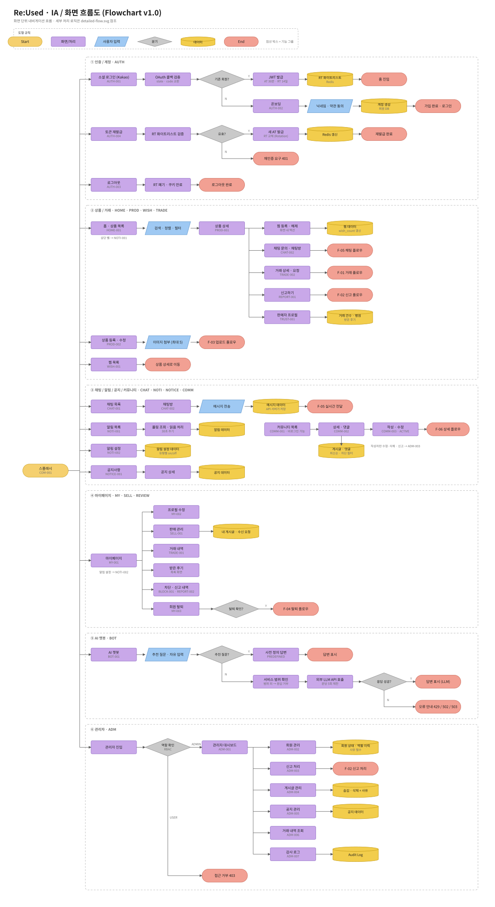
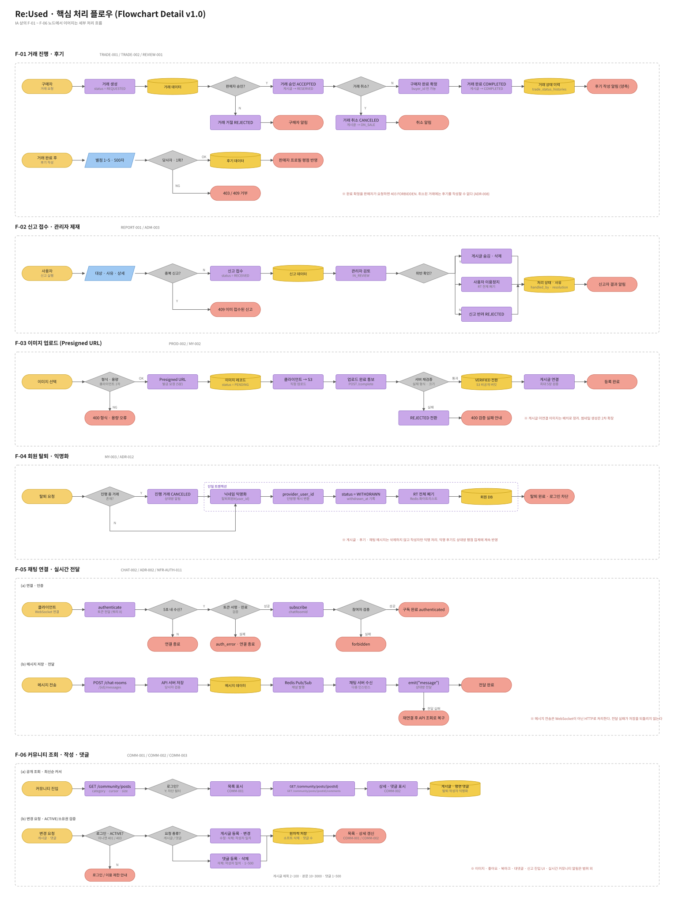
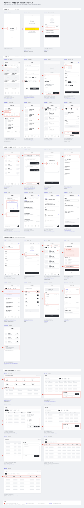

# 설계 문서 자료 정리본

상태: 진행 중
생성자: 장훈 서

[초기 문서](../initial-design/README.md)

---

### 서비스 설계 문서 (개발을 고려해 클라우드 아키텍처는 분리해서 작성 → 인프라 전체 설계 문서에)

[PRD(Product Requirements Document)](../../01-requirements/product-requirements.md)

[ADR(Architectural Decision Record) - Service](../../03-architecture/README.md)

[ERD 명세](../../04-data/README.md)

[규칙 명세](../../02-functional-design/business-rules.md)

[API 명세](../../05-api/api-spec.md)

| 문서 | 역할 (AI 활용 시) |
| --- | --- |
| PRD | 맥락 (뭘 만드는지) |
| ADR | 제약 (어떤 기술로) |
| ERD | 구조 (데이터가 어떻게 생겼는지) |
| 규칙 명세 | 판단 기준 (어떻게 동작해야 하는지) |
| API 명세 | 인터페이스 (어떤 형태로) |
| 플로우 차트 | 흐름 (어떤 순서로 이어지는지) |
| 화면설계서 | 화면 (사용자에게 어떻게 보이는지) |
- 업데이트된 플로우차트(IA · 처리 흐름) + 화면설계서(Wireframe)
    - 피그마에서 열면 수정 가능

